## Deploy Azure Arc-enabled SQL Managed Instance in directly connected mode on a Microk8s Kubernetes cluster in an Azure VM using ARM Templates

The following Jumpstart scenario will guide you on how to deploy a "Ready to Go" environment so you can start using [Azure Arc-enabled data services](https://docs.microsoft.com/azure/azure-arc/data/overview) and [SQL Managed Instance](https://docs.microsoft.com/azure/azure-arc/data/managed-instance-overview) deployed on a single-node [Microk8s](https://microk8s.io/) Kubernetes cluster.

By the end of this scenario, you will have a Microk8s Kubernetes cluster deployed with an Azure Arc Data Controller & SQL Managed Instance (with a sample database), and a Microsoft Windows Server 2022 (Datacenter) Azure Client VM, installed & pre-configured with all the required tools needed to work with Azure Arc-enabled data services:

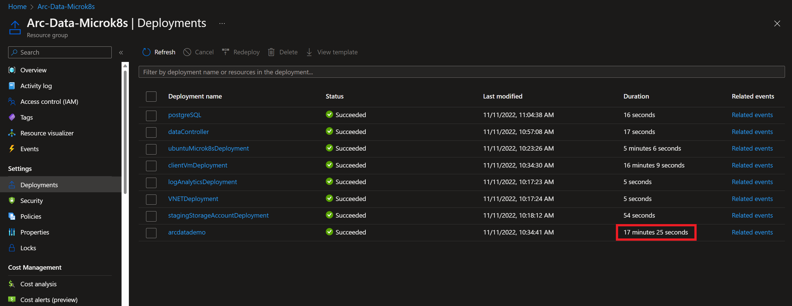

> **NOTE: Currently, Azure Arc-enabled data services with PostgreSQL is in [public preview](https://docs.microsoft.com/azure/azure-arc/data/release-notes)**.

## Prerequisites

- Clone the Azure Arc Jumpstart repository

  ```shell
  git clone https://github.com/microsoft/azure_arc.git
  ```

- [Install or update Azure CLI to version 2.36.0 and above](https://docs.microsoft.com/cli/azure/install-azure-cli?view=azure-cli-latest). Use the below command to check your current installed version.

  ```shell
  az --version
  ```

- [Generate SSH Key](https://docs.microsoft.com/azure/virtual-machines/linux/create-ssh-keys-detailed) (or use existing ssh key).

- Create Azure service principal (SP). To deploy this scenario, an Azure service principal assigned with multiple RBAC roles is required:

  - "Contributor" - Required for provisioning Azure resources
  - "Security admin" - Required for installing Cloud Defender Azure-Arc enabled Kubernetes extension and dismiss alerts
  - "Security reader" - Required for being able to view Azure-Arc enabled Kubernetes Cloud Defender extension findings
  - "Monitoring Metrics Publisher" - Required for being Azure Arc-enabled data services billing, monitoring metrics, and logs management

    To create it login to your Azure account run the below command (this can also be done in [Azure Cloud Shell](https://shell.azure.com/).

    ```shell
    az login
    subscriptionId=$(az account show --query id --output tsv)
    az ad sp create-for-rbac -n "<Unique SP Name>" --role "Contributor" --scopes /subscriptions/$subscriptionId
    az ad sp create-for-rbac -n "<Unique SP Name>" --role "Security admin" --scopes /subscriptions/$subscriptionId
    az ad sp create-for-rbac -n "<Unique SP Name>" --role "Security reader" --scopes /subscriptions/$subscriptionId
    az ad sp create-for-rbac -n "<Unique SP Name>" --role "Monitoring Metrics Publisher" --scopes /subscriptions/$subscriptionId
    ```

    For example:

    ```shell
    az login
    subscriptionId=$(az account show --query id --output tsv)
    az ad sp create-for-rbac -n "JumpstartArcDataSvc" --role "Contributor" --scopes /subscriptions/$subscriptionId
    az ad sp create-for-rbac -n "JumpstartArcDataSvc" --role "Security admin" --scopes /subscriptions/$subscriptionId
    az ad sp create-for-rbac -n "JumpstartArcDataSvc" --role "Security reader" --scopes /subscriptions/$subscriptionId
    az ad sp create-for-rbac -n "JumpstartArcDataSvc" --role "Monitoring Metrics Publisher" --scopes /subscriptions/$subscriptionId
    ```

    Output should look like this:

    ```json
    {
    "appId": "XXXXXXXXXXXXXXXXXXXXXXXXXXXX",
    "displayName": "JumpstartArcDataSvc",
    "password": "XXXXXXXXXXXXXXXXXXXXXXXXXXXX",
    "tenant": "XXXXXXXXXXXXXXXXXXXXXXXXXXXX"
    }
    ```

    > **NOTE: If you create multiple subsequent role assignments on the same service principal, your client secret (password) will be destroyed and recreated each time. Therefore, make sure you grab the correct password**.

    > **NOTE: The Jumpstart scenarios are designed with as much ease of use in-mind and adhering to security-related best practices whenever possible. It is optional but highly recommended to scope the service principal to a specific [Azure subscription and resource group](https://docs.microsoft.com/cli/azure/ad/sp?view=azure-cli-latest) as well considering using a [less privileged service principal account](https://docs.microsoft.com/azure/role-based-access-control/best-practices)**

## Architecture (In a nutshell)

From the [Microk8s GitHub repo](https://github.com/ubuntu/microk8s):

_"Microk8s is a single-package, fully conformant, lightweight Kubernetes that works on 42 flavors of Linux. Perfect for Developer workstations, IoT, Edge & CI/CD. MicroK8s tracks upstream and releases beta, RC and final bits the same day as upstream K8s."_

in this scenario, we automate the installation of Microk8s on an Ubuntu 18.04 VM running on Azure using a few simple commands to install from the [Snap Store](https://snapcraft.io/microk8s), before proceeding to onboard it as an Azure Arc-enabled Kubernetes Cluster.

Once our K8s Cluster is onboarded, we proceed to create a [Custom Location](https://docs.microsoft.com/azure/azure-arc/kubernetes/custom-locations), and deploy an Azure Arc Data Controller in [Directly Connected mode](https://docs.microsoft.com/azure/azure-arc/data/connectivity#connectivity-modes).

## Automation Flow

For you to get familiar with the automation and deployment flow, below is an explanation.

- User is editing the ARM template parameters file (1-time edit). These parameters values are being used throughout the deployment.

- Main [_azuredeploy_](https://github.com/microsoft/azure_arc/blob/main/azure_arc_data_jumpstart/microk8s/azure/arm_template/azuredeploy.json) ARM template will initiate **five** linked ARM templates:

  - [_VNET_](https://github.com/microsoft/azure_arc/blob/main/azure_arc_data_jumpstart/microk8s/azure/arm_template/VNET.json) - Deploys a Virtual Network with a single subnet - used by our VMs.
  - [_ubuntuMicrok8s_](https://github.com/microsoft/azure_arc/blob/main/azure_arc_data_jumpstart/microk8s/azure/arm_template/ubuntuMicrok8s.json) - Deploys an Ubuntu Linux VM which will have Microk8s installed from the Snap Store.
  - [_clientVm_](https://github.com/microsoft/azure_arc/blob/main/azure_arc_data_jumpstart/microk8s/azure/arm_template/clientVm.json) - Deploys the Client Windows VM. This is where all user interactions with the environment are made from.
  - [_mgmtStagingStorage_](https://github.com/microsoft/azure_arc/blob/main/azure_arc_data_jumpstart/microk8s/azure/arm_template/mgmtStagingStorage.json) - Used for staging files in automation scripts and [kubeconfig](https://kubernetes.io/docs/concepts/configuration/organize-cluster-access-kubeconfig/).
  - [_logAnalytics_](https://github.com/microsoft/azure_arc/blob/main/azure_arc_data_jumpstart/microk8s/azure/arm_template/logAnalytics.json) - Deploys Azure Log Analytics workspace to support Azure Arc-enabled data services logs upload.

- User remotes into Client Windows VM, which automatically kicks off the [_DataServicesLogonScript_](https://github.com/microsoft/azure_arc/blob/main/azure_arc_data_jumpstart/microk8s/azure/arm_template/artifacts/DataServicesLogonScript.ps1) PowerShell script that deploys and configure Azure Arc-enabled data services on the Microk8s Kubernetes cluster - including the data controller.

## Deployment

As mentioned, this deployment will leverage ARM templates. You will deploy a single template that will initiate the entire automation for this scenario.

- The deployment is using the ARM template parameters file. Before initiating the deployment, edit the [_azuredeploy.parameters.json_](https://github.com/microsoft/azure_arc/blob/main/azure_arc_data_jumpstart/microk8s/azure/arm_template/azuredeploy.parameters.json) file located in your local cloned repository folder. An example parameters file is located [here](https://github.com/microsoft/azure_arc/blob/main/azure_arc_data_jumpstart/microk8s/azure/arm_template/artifacts/azuredeploy.parameters.example.json) (ensure to set `deploySQLMI` to _**true**_):

  - `sshRSAPublicKey` - Your SSH public key - sample syntax: `ssh-rsa AAAAB3N...NDOCE7U3DLBISw==\n`.
  - `spnClientId` - Your Azure service principal id.
  - `spnClientSecret` - Your Azure service principal secret.
  - `spnTenantId` - Your Azure tenant id.
  - `windowsAdminUsername` - Client Windows VM Administrator name.
  - `windowsAdminPassword` - Client Windows VM Password. Password must have 3 of the following: 1 lower case character, 1 upper case character, 1 number, and 1 special character. The value must be between 12 and 123 characters long.
  - `logAnalyticsWorkspaceName` - Unique name for log analytics workspace deployment.
  - `deploySQLMI` - Boolean that sets whether or not to deploy SQL Managed Instance, for this data controller and Azure SQL Managed Instance scenario, we will set it to _**true**_.
  - `deployPostgreSQL` - Boolean that sets whether or not to deploy PostgreSQL, for this data controller and Azure SQL Managed Instance scenario, we leave it set to _**false**_.
  - `templateBaseUrl` - GitHub URL to the deployment template - filled in by default to point to [Microsoft/Azure Arc](https://github.com/microsoft/azure_arc) repository, but you can point this to your forked repo as well.
  - `deployBastion` - Choice (true | false) to deploy Azure Bastion.

- To deploy the ARM template, navigate to the local cloned [deployment folder](https://github.com/microsoft/azure_arc/tree/main/azure_arc_data_jumpstart/microk8s/azure/arm_template) and run the below command:

  ```shell
  az group create --name <Name of the Azure resource group> --location <Azure Region>
  az deployment group create \
  --resource-group <Name of the Azure resource group> \
  --name <The name of this deployment> \
  --template-uri https://raw.githubusercontent.com/microsoft/azure_arc/main/azure_arc_data_jumpstart/microk8s/azure/arm_template/azuredeploy.json \
  --parameters <The *azuredeploy.parameters.json* parameters file location>
  ```

  > **NOTE: Make sure that you are using the same Azure resource group name as the one you've just used in the `azuredeploy.parameters.json` file**

  For example:

  ```shell
  az group create --name Arc-Data-Microk8s --location "East US"
  az deployment group create \
  --resource-group Arc-Data-Microk8s \
  --name arcdatademo \
  --template-uri https://raw.githubusercontent.com/microsoft/azure_arc/main/azure_arc_data_jumpstart/microk8s/azure/arm_template/azuredeploy.json \
  --parameters azuredeploy.parameters.json
  --parameters templateBaseUrl="https://raw.githubusercontent.com/your--github--handle/azure_arc/microk8s-data/azure_arc_data_jumpstart/microk8s/azure/arm_template/"
  ```

  > **NOTE: The deployment time for this scenario can take ~15-20min**

  

- Once Azure resources have been provisioned, you will be able to see it in the Azure portal. At this point, the resource group should have **13 various Azure resources deployed**.

  

  

## Windows Login & Post Deployment

Various options are available to connect to _Arc-Data-Client_ VM, depending on the parameters you supplied during deployment.

- [RDP](https://azurearcjumpstart.io/azure_arc_jumpstart/azure_arc_data/microk8s/azure/arm_template/mssql_mi/#connecting-directly-with-rdp) - available after configuring access to port 3389 on the _Arc-App-Client-NSG_, or by enabling [Just-in-Time access (JIT)](https://azurearcjumpstart.io/azure_arc_jumpstart/azure_arc_data/microk8s/azure/arm_template/mssql_mi/#connect-using-just-in-time-accessjit).
- [Azure Bastion](https://azurearcjumpstart.io/azure_arc_jumpstart/azure_arc_data/microk8s/azure/arm_template/mssql_mi/#connect-using-azure-bastion) - available if ```true``` was the value of your _`deployBastion`_ parameter during deployment.

### Connecting directly with RDP

By design, port 3389 is not allowed on the network security group. Therefore, you must create an NSG rule to allow inbound 3389.

- Open the _Arc-Data-Client-NSG_ resource in Azure portal and click "Add" to add a new rule.

  

  

- Specify the IP address that you will be connecting from and select RDP as the service with "Allow" set as the action. You can retrieve your public IP address by accessing [https://icanhazip.com](https://icanhazip.com) or [https://whatismyip.com](https://whatismyip.com).

  

  

  

### Connect using Azure Bastion

- If you have chosen to deploy Azure Bastion in your deployment, use it to connect to the VM.

  

  > **NOTE: When using Azure Bastion, the desktop background image is not visible. Therefore some screenshots in this guide may not exactly match your experience if you are connecting to _ArcBox-Client_ with Azure Bastion.**

### Connect using just-in-time access (JIT)

If you already have [Microsoft Defender for Cloud](https://docs.microsoft.com/azure/defender-for-cloud/just-in-time-access-usage?tabs=jit-config-asc%2Cjit-request-asc) enabled on your subscription and would like to use JIT to access the Client VM, use the following steps:

- In the Client VM configuration pane, enable just-in-time. This will enable the default settings.

  

  

### Post Deployment

- At first login, as mentioned in the "Automation Flow" section above, the [_DataServicesLogonScript_](https://github.com/microsoft/azure_arc/blob/main/azure_arc_data_jumpstart/microk8s/azure/arm_template/artifacts/DataServicesLogonScript.ps1) PowerShell logon script will start it's run.

- Let the script run it's course and **do not close** the PowerShell session, this will be done for you once completed.

  

  Once the script will finish it's run, the logon script PowerShell session will be closed, the Windows wallpaper will change and both the Azure Arc Data Controller and the SQL Managed Instance will be deployed on the cluster and be ready to use:

  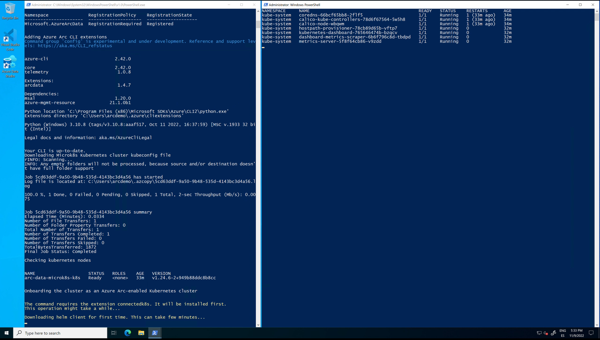

- Since this scenario is deploying the Azure Arc Data Controller and SQL Managed Instance, you will also notice additional newly deployed Azure resources in the resources group (at this point you should have **17 various Azure resources deployed**. The important ones to notice are:

  - **Azure Arc-enabled Kubernetes cluster** - Azure Arc-enabled data services deployed in directly connected mode is using this resource to deploy the data services [cluster extension](https://docs.microsoft.com/azure/azure-arc/kubernetes/conceptual-extensions), as well as using Azure Arc [Custom locations](https://docs.microsoft.com/azure/azure-arc/kubernetes/conceptual-custom-locations).

  - **Custom location** - provides a way for tenant administrators to use their Azure Arc-enabled Kubernetes clusters as a target location for deploying Azure services.

  - **Azure Arc Data Controller** - The data controller that is now deployed on the Kubernetes cluster.

  - **Azure Arc-enabled SQL Managed Instance** - The SQL Managed Instance that is now deployed on the Kubernetes cluster.

  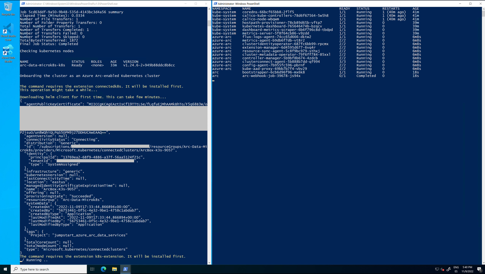

- Another tool automatically deployed is Azure Data Studio along with the _Azure Data CLI_, the _Azure Arc_ and the _PostgreSQL_ extensions. Using the Desktop shortcut created for you, open Azure Data Studio and click the Extensions settings to see both extensions.

  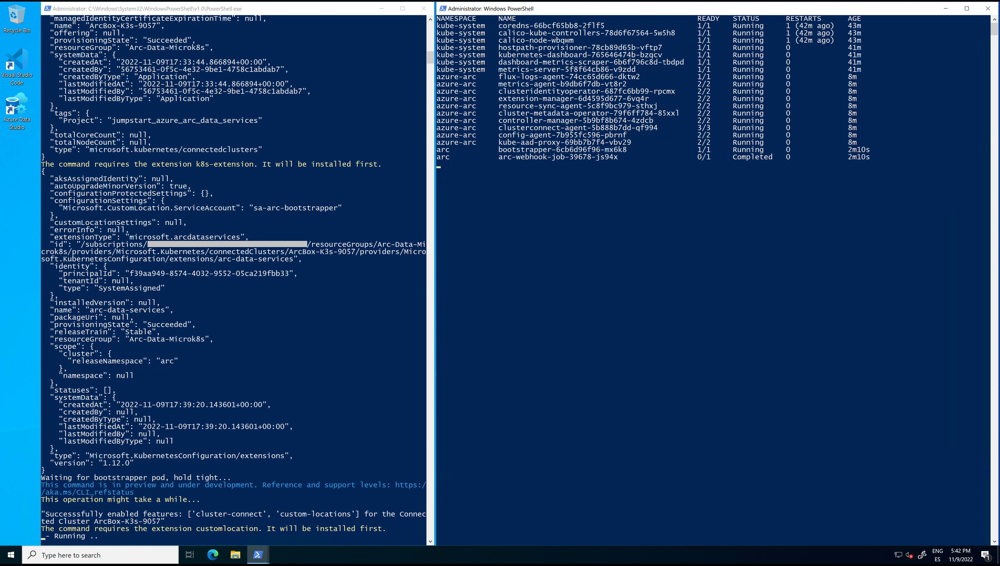

- Additionally, the SQL Managed Instance connection will be configured within Data Studio, as well as the sample [_AdventureWorks_](https://docs.microsoft.com/sql/samples/adventureworks-install-configure?view=sql-server-ver15&tabs=ssms) database will be restored automatically for you.

  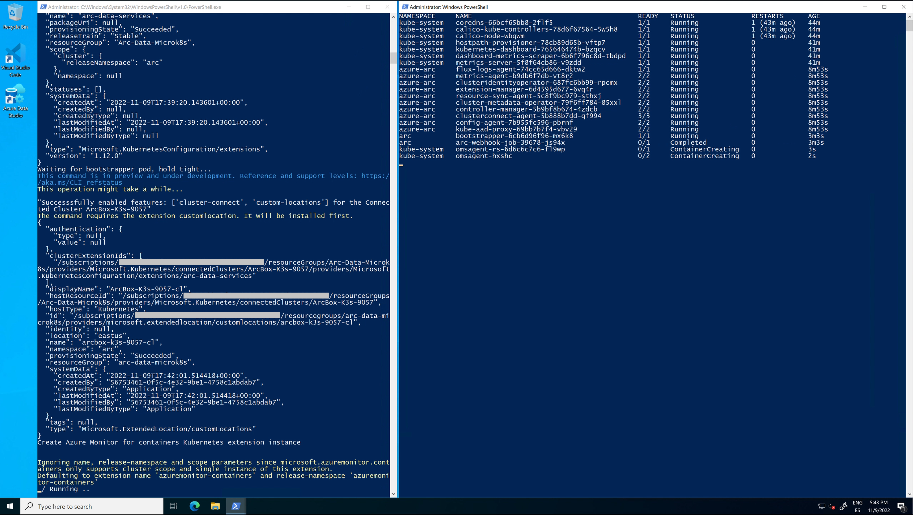

## Cluster extensions

In this scenario, **three** Azure Arc-enabled Kubernetes cluster extensions were deployed:

- `microsoft.azuredefender.kubernetes` - The Azure Defender cluster extension. To learn more about it, you can check our Jumpstart ["Integrate Azure Defender with Cluster API as an Azure Arc Connected Cluster using Kubernetes extensions"](https://azurearcjumpstart.io/azure_arc_jumpstart/azure_arc_k8s/day2/cluster_api/cluster_api_defender_extension/#create-azure-defender-extensions-instance) scenario.

- `azuremonitor-containers` - The Azure Monitor for containers cluster extension. To learn more about it, you can check our Jumpstart ["Integrate Azure Monitor for Containers with GKE as an Azure Arc Connected Cluster using Kubernetes extensions](https://azurearcjumpstart.io/azure_arc_jumpstart/azure_arc_k8s/day2/gke/gke_monitor_extension/) scenario.

- `arc-data-services` - The Azure Arc-enabled data services cluster extension that was used throughout this scenario in order to deploy the data services infrastructure.

  In order to view these cluster extensions, click on the Azure Arc-enabled Kubernetes resource Extensions settings.

  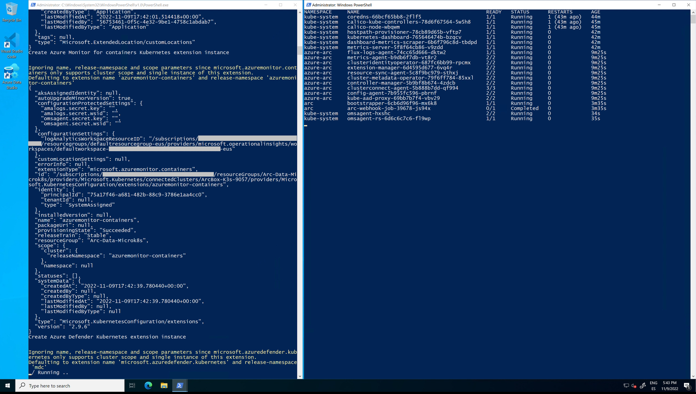

  And we see the installed extensions:
  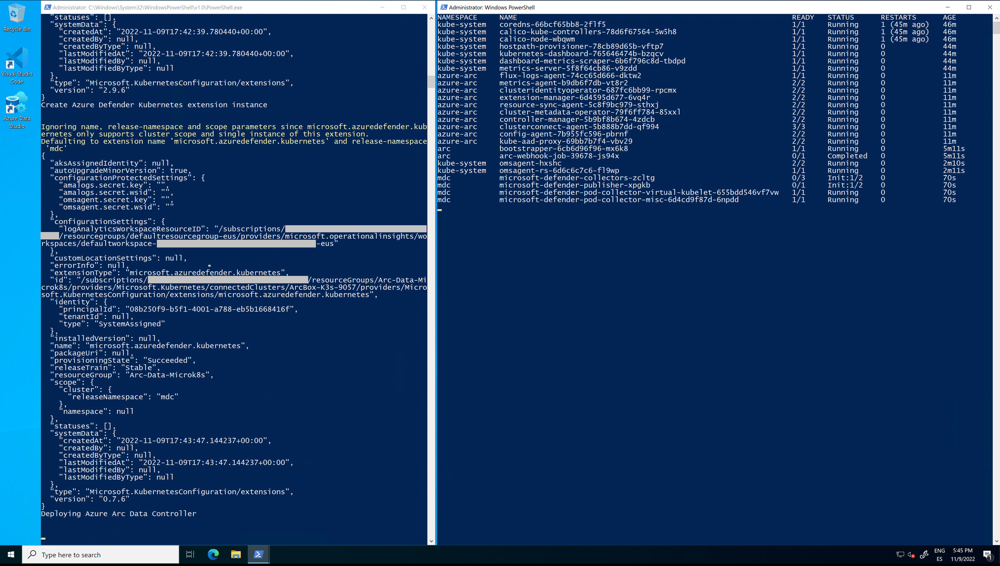

## Operations

### Azure Arc-enabled SQL Managed Instance Stress Simulation

Included in this scenario, is a dedicated SQL stress simulation tool named _SqlQueryStress_ automatically installed for you on the Client VM. _SqlQueryStress_ will allow you to generate load on the Azure Arc-enabled SQL Managed Instance that can be done used to showcase how the SQL database and services are performing as well to highlight operational practices described in the next section.

- To start with, open the _SqlQueryStress_ desktop shortcut and connect to the SQL Managed Instance **primary** endpoint IP address. This can be found in the _SQLMI Endpoints_ text file desktop shortcut that was also created for you alongside the username and password you used to deploy the environment.

  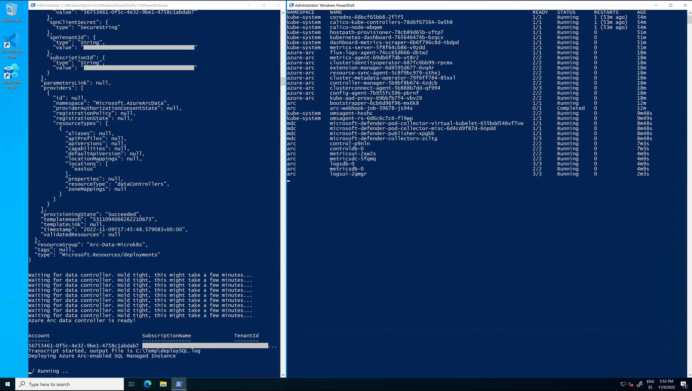

  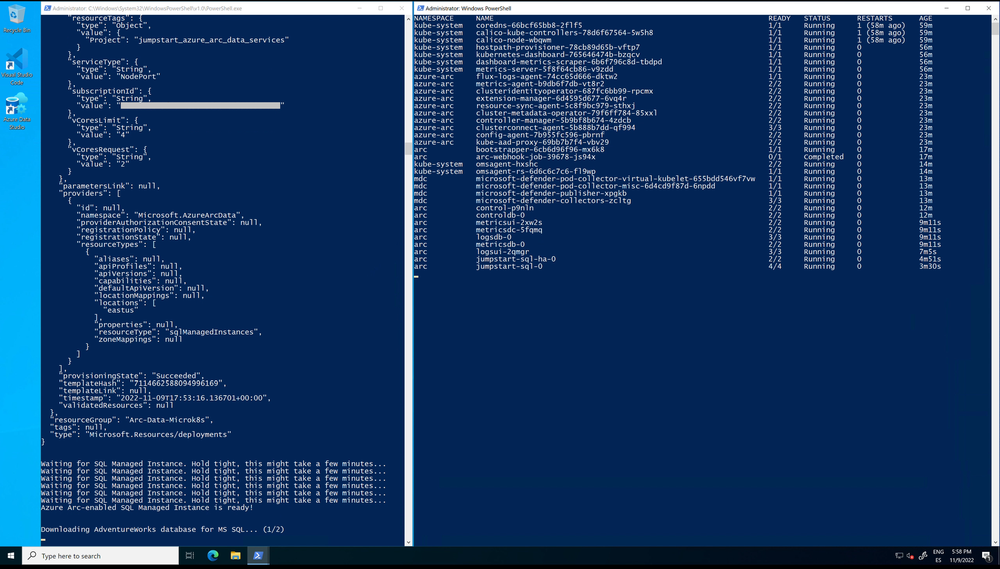

> **NOTE: Secondary SQL Managed Instance endpoint will be available only when using the HA deployment model ("Business Critical").**

- To connect, use "SQL Server Authentication" and select the deployed sample _AdventureWorks_ database (you can use the "Test" button to check the connection).

  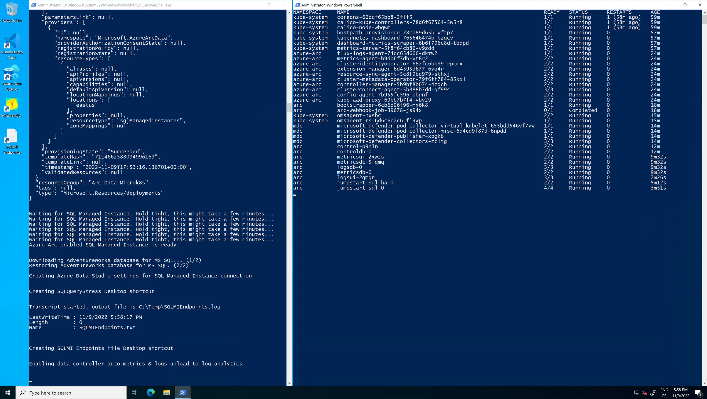

- To generate some load, we will be running a simple stored procedure. Copy the below procedure and change the number of iterations you want it to run as well as the number of threads to generate even more load on the database. In addition, change the delay between queries to 1ms for allowing the stored procedure to run for a while.

    ```sql
    exec [dbo].[uspGetEmployeeManagers] @BusinessEntityID = 8
    ```

- As you can see from the example below, the configuration settings are 100,000 iterations, five threads per iteration, and a 1ms delay between queries. These configurations should allow you to have the stress test running for a while.

  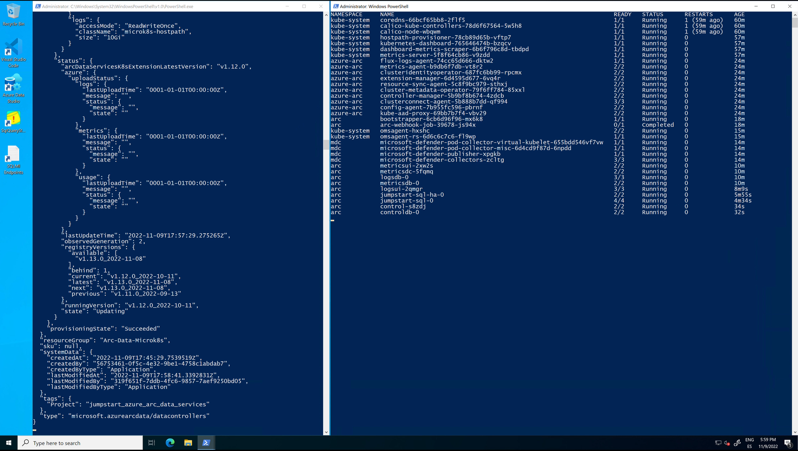

  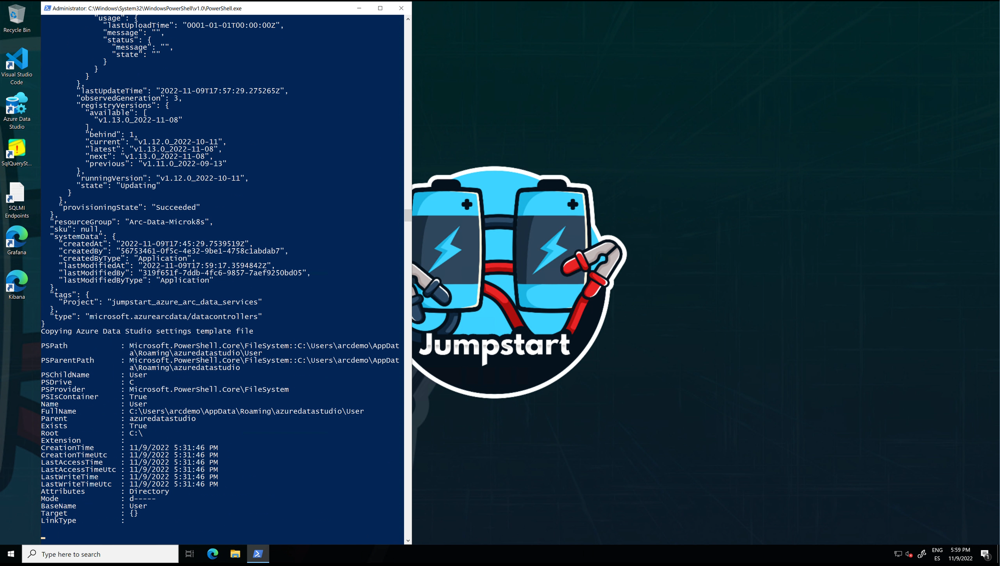

### Azure Arc-enabled SQL Managed Instance monitoring using Grafana

When deploying Azure Arc-enabled data services, a [Grafana](https://grafana.com/) instance is also automatically deployed on the same Kubernetes cluster and include built-in dashboards for both Kubernetes infrastructure as well SQL Managed Instance monitoring (PostgreSQL dashboards are included as well but we will not be covering these in this section).

- Now that you have the _SqlQueryStress_ stored procedure running and generating load, we can look how this is shown in the the built-in Grafana dashboard. As part of the automation, a new URL desktop shortcut simply named "Grafana" was created.

  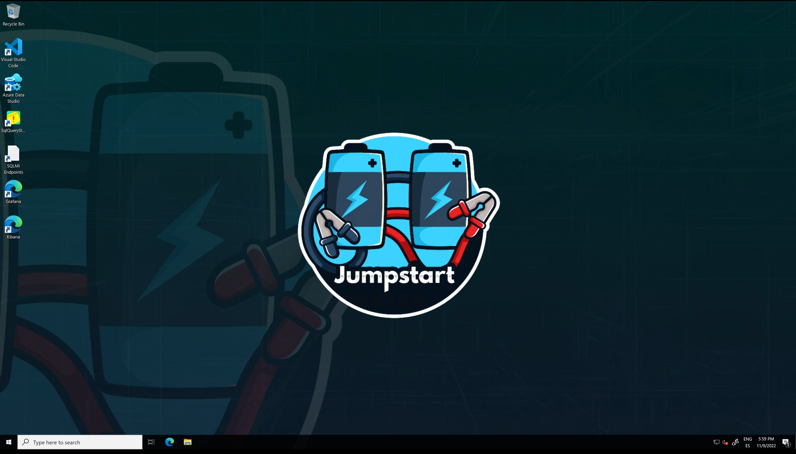

- [Optional] The IP address for this instance represents the Kubernetes _LoadBalancer_ external IP that was provision as part of Azure Arc-enabled data services. Use the _```kubectl get svc -n arc```_ command to view the _metricsui_ external service IP address.

  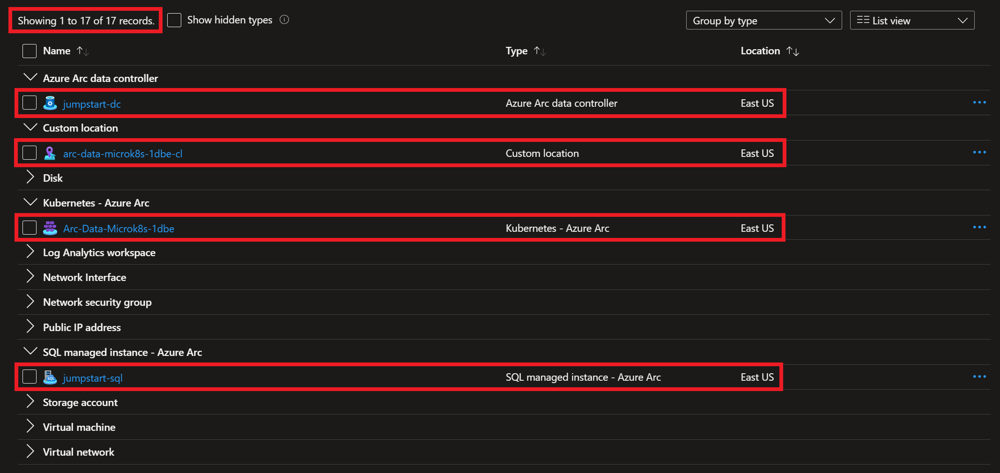

- To log in, use the same username and password that is in the _SQLMI Endpoints_ text file desktop shortcut.

  

- Navigate to the built-in "SQL Managed Instance Metrics" dashboard.

  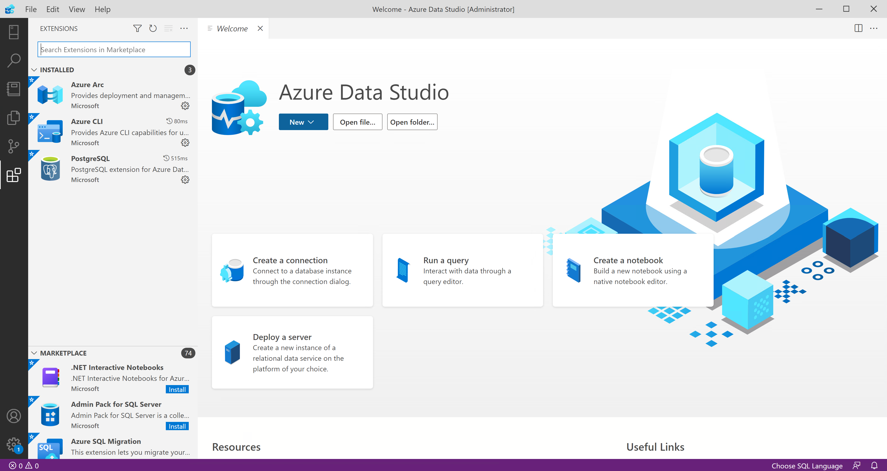

  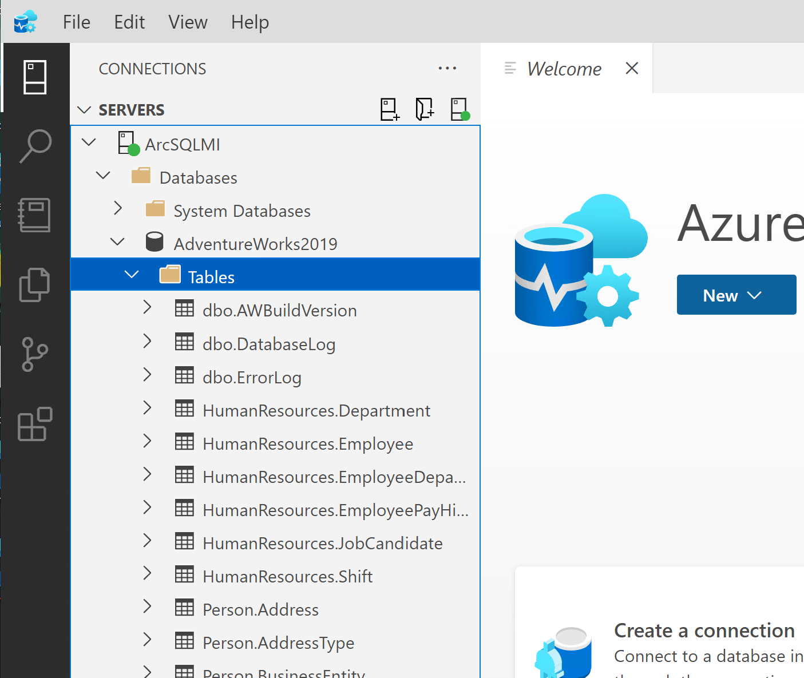

- Change the dashboard time range to "Last 5 minutes" and re-run the stress test using _SqlQueryStress_ (in case it was already finished).

  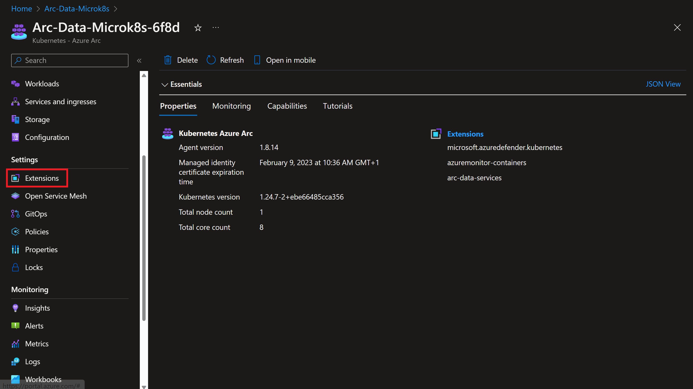

- You can now see how the SQL graphs are starting to show increased activity and load on the database instance.

  

  

## Cleanup

- If you want to delete the entire environment, simply delete the deployed resource group from the Azure portal.

  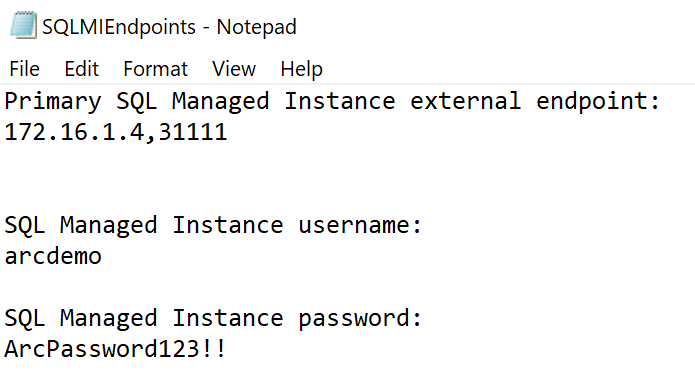

<!-- ## Known Issues -->
