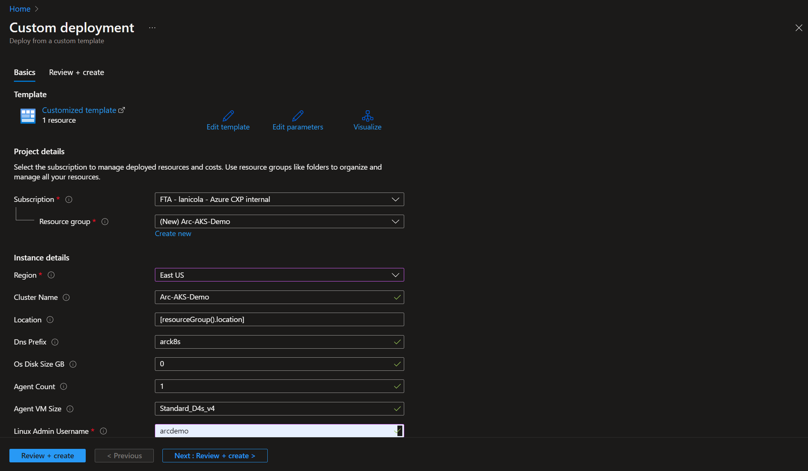
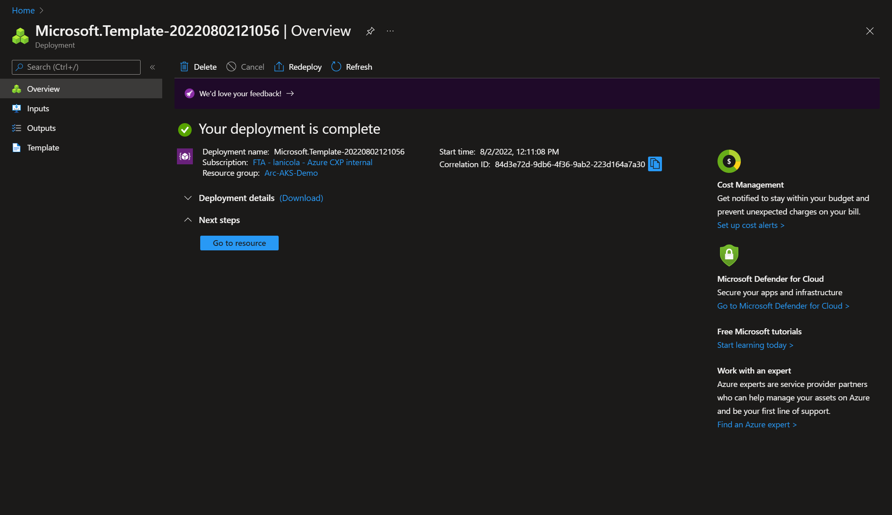
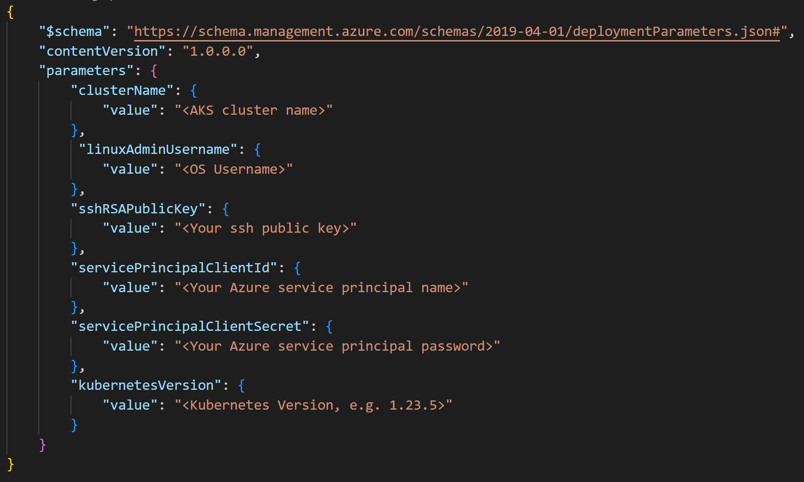
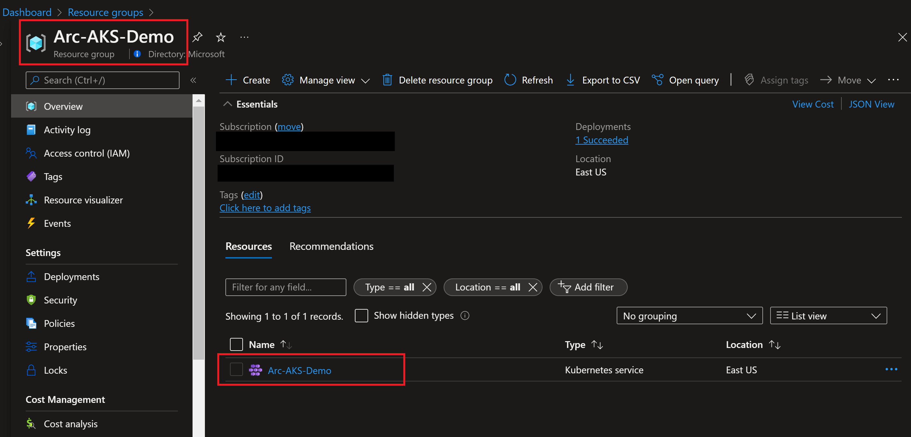
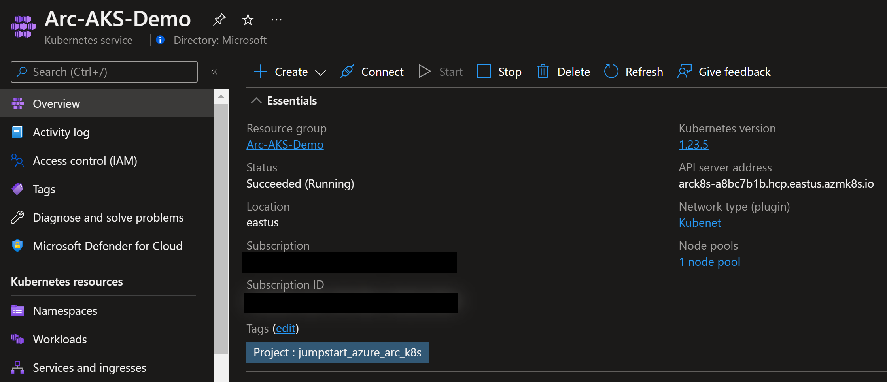
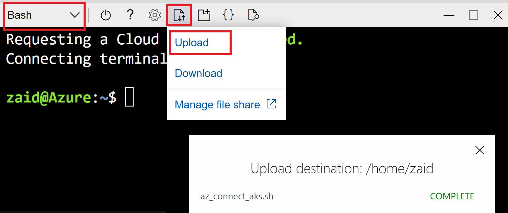
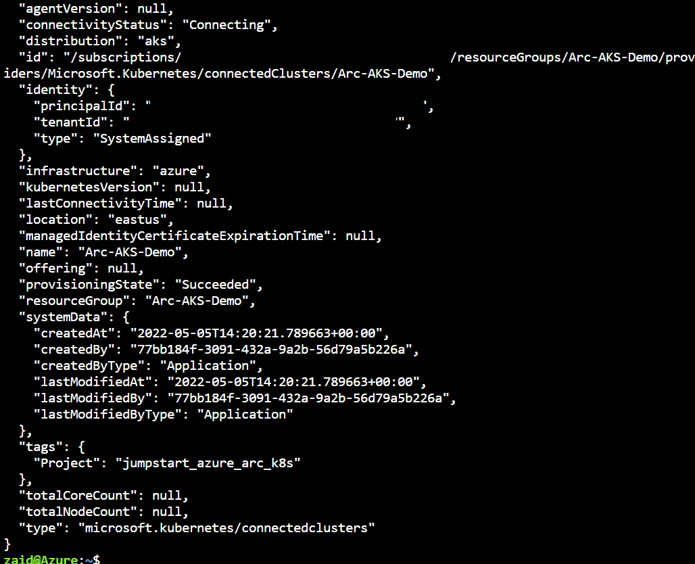
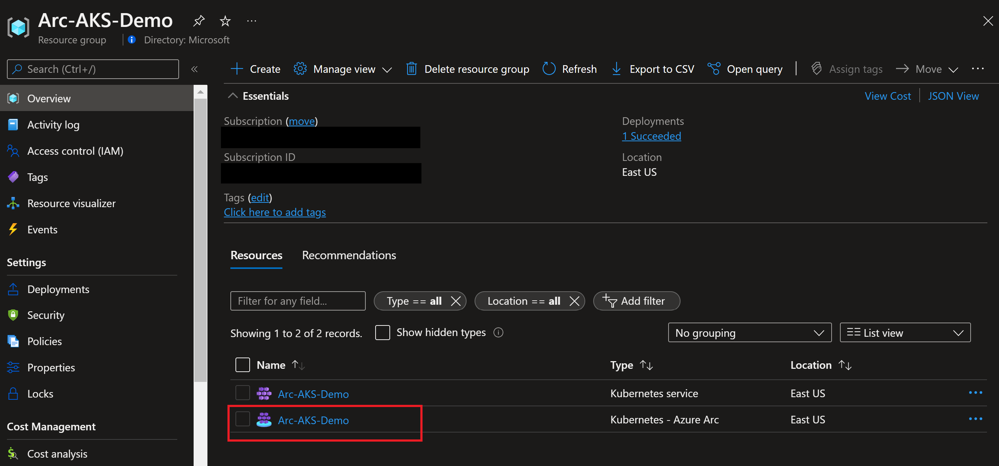

## Deploy AKS cluster and connect it to Azure Arc using an Azure ARM template

The following Jumpstart scenario will guide you on how to use the provided [Azure ARM Template](https://docs.microsoft.com/azure/azure-resource-manager/templates/overview) to deploy an [Azure Kubernetes Service (AKS)](https://docs.microsoft.com/azure/aks/intro-kubernetes) cluster and connected it as an Azure Arc cluster resource.

  > **NOTE: Since AKS is a 1st-party Azure solution and natively supports capabilities such as [Azure Monitor](https://docs.microsoft.com/azure/azure-monitor/insights/container-insights-overview) integration as well as GitOps configurations, it is not expected for an AKS cluster to be projected as an Azure Arc-enabled Kubernetes cluster. The following scenario should ONLY be used for demo and testing purposes.**

## Prerequisites

- Clone the Azure Arc Jumpstart repository

    ```shell
    git clone https://github.com/microsoft/azure_arc.git
    ```
  
- [Install or update Azure CLI to version 2.25.0 and above](https://docs.microsoft.com/cli/azure/install-azure-cli?view=azure-cli-latest). Use the below command to check your current installed version.

  ```shell
  az --version
  ```

- [Generate SSH Key](https://docs.microsoft.com/azure/virtual-machines/linux/create-ssh-keys-detailed) (or use existing ssh key).

- Create Azure service principal (SP)

    To be able to complete the scenario and its related automation, Azure service principal assigned with the “Contributor” role is required. To create it, login to your Azure account run the below command (this can also be done in [Azure Cloud Shell](https://shell.azure.com/)).

    ```shell
    az login
    subscriptionId=$(az account show --query id --output tsv)
    az ad sp create-for-rbac -n "<Unique SP Name>" --role "Contributor" --scopes /subscriptions/$subscriptionId
    ```

    For example:

    ```shell
    az login
    subscriptionId=$(az account show --query id --output tsv)
    az ad sp create-for-rbac -n "JumpstartArcK8s" --role "Contributor" --scopes /subscriptions/$subscriptionId
    ```

    Output should look like this:

    ```json
    {
    "appId": "XXXXXXXXXXXXXXXXXXXXXXXXXXXX",
    "displayName": "JumpstartArcK8s",
    "password": "XXXXXXXXXXXXXXXXXXXXXXXXXXXX",
    "tenant": "XXXXXXXXXXXXXXXXXXXXXXXXXXXX"
    }
    ```

    > **NOTE: If you create multiple subsequent role assignments on the same service principal, your client secret (password) will be destroyed and recreated each time. Therefore, make sure you grab the correct password**.

    > **NOTE: The Jumpstart scenarios are designed with as much ease of use in-mind and adhering to security-related best practices whenever possible. It is optional but highly recommended to scope the service principal to a specific [Azure subscription and resource group](https://docs.microsoft.com/cli/azure/ad/sp?view=azure-cli-latest) as well considering using a [less privileged service principal account](https://docs.microsoft.com/azure/role-based-access-control/best-practices)**

## Deployment

- Before deploying the ARM template, determine which AKS Kubernetes versions are available in your region using the below Azure CLI command.

  ```shell
  az aks get-versions -l "<Your Azure Region>"
  ```

- The deployment is using the template parameters file. Before initiating the deployment, edit the [*azuredeploy.parameters.json*](https://github.com/microsoft/azure_arc/blob/main/azure_arc_k8s_jumpstart/aks/arm_template/azuredeploy.parameters.json) file to match your environment and using one of the available Kubernetes Versions from the previous step.

  

- To deploy the ARM template, navigate to the [deployment folder](https://github.com/microsoft/azure_arc/tree/main/azure_arc_k8s_jumpstart/aks/arm_template) and run the below command:

  ```shell
  az group create --name <Name of the Azure resource group> --location <Azure Region>
  az deployment group create \
  --resource-group <Name of the Azure resource group> \
  --name <The name of this deployment> \
  --template-uri https://raw.githubusercontent.com/microsoft/azure_arc/main/azure_arc_k8s_jumpstart/aks/arm_template/azuredeploy.json \
  --parameters <The *azuredeploy.parameters.json* parameters file location>
  ```

  For example:

  ```shell
  az group create --name Arc-AKS-Demo --location "East US"
  az deployment group create \
  --resource-group Arc-AKS-Demo \
  --name arcaksdemo01 \
  --template-uri https://raw.githubusercontent.com/microsoft/azure_arc/main/azure_arc_k8s_jumpstart/aks/arm_template/azuredeploy.json \
  --parameters azuredeploy.parameters.json
  ```

- Once the ARM template deployment is completed, a new AKS cluster in a new Azure resource group is created.

  

  

## Automation Flow

For you to get familiar with the automation and deployment flow, below is an explanation.

- User is editing the environment variables in the Shell script file (1-time edit) which then be used throughout the deployment.
- User is running the shell script. The script will:
  - Connect to Azure using SPN credentials.
  - Get AKS credentials
  - Install Azure Arc CLI extensions
  - Connecting the cluster to Azure Arc

## Connecting to Azure Arc

- Now that you have a running AKS cluster, edit the environment variables section in the included [az_connect_aks](https://github.com/microsoft/azure_arc/blob/main/azure_arc_k8s_jumpstart/aks/arm_template/scripts/az_connect_aks.sh) shell script.

  

  For example:

  

- In order to keep your local environment clean and untouched, we will use [Azure Cloud Shell](https://docs.microsoft.com/azure/cloud-shell/overview) (located in the top-right corner in the Azure portal) to run the *az_connect_aks* shell script against the AKS cluster. **Make sure Cloud Shell is configured to use Bash.**

  

- After editing the environment variables in the [*az_connect_aks*](https://github.com/microsoft/azure_arc/blob/main/azure_arc_k8s_jumpstart/aks/arm_template/scripts/az_connect_aks.sh) shell script to match your parameters, save the file and then upload it to the Cloud Shell environment and run it using the ```. ./az_connect_aks.sh``` command.

  > **NOTE: The extra dot is due to the script having an *export* function and needs to have the vars exported in the same shell session as the other commands.**

  

  

- Once the script run has finished, the AKS cluster will be projected as a new Azure Arc cluster resource.

  

  

  

## Delete the deployment

The most straightforward way is to delete the Azure Arc cluster resource via the Azure Portal, just select the cluster and delete it.



If you want to nuke the entire environment, run the below commands.

```shell
az deployment group delete --name <Deployment name> --resource-group <Azure resource group name>
```

```shell
az group delete --name <Azure resource group name> --yes
```

For example:

```shell
az deployment group delete --name arcaksdemo01 --resource-group Arc-AKS-Demo
```

```shell
az group delete --name Arc-AKS-Demo --yes
```
