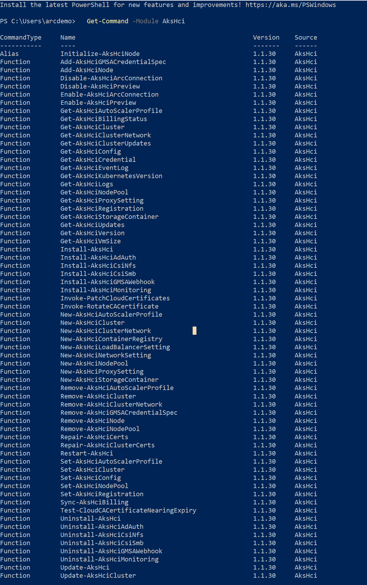
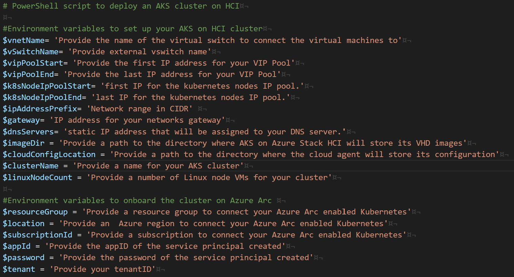

## Deploy AKS cluster on Azure Stack HCI and connect it to Azure Arc using PowerShell

The following Jumpstart scenario will guide you on how to use the provided PowerShell script to deploy an [Azure Kubernetes Service (AKS)](https://docs.microsoft.com/en-us/azure/aks/intro-kubernetes) cluster on [Azure Stack HCI](https://docs.microsoft.com/en-us/azure-stack/hci/overview) and connected it as an Azure Arc cluster resource.

Azure Kubernetes Service on Azure Stack HCI is an implementation of AKS on-premises using hyperconverged infrastructure operating system that is delivered as an Azure service.  

This guide will not provide instructions on how to deploy and set up Azure Stack HCI and it assumes you already have a configured cluster. The commands described in this guide should be run on the management computer or in a host server in a cluster.

## Prerequisites

- Clone the Azure Arc Jumpstart repository

    ```shell
    git clone https://github.com/microsoft/azure_arc.git
    ```
  
- Create Azure service principal (SP)

    To be able to complete the scenario and its related automation, an Azure service principal assigned with the “Contributor” role is required. To create it, login to your Azure account using PowerShell and run the below command. To do this, you will need to run the script from a PowerShell session that has access to your AKS on the Azure Stack HCI environment.

    ```powershell
    Connect-AzAccount
    $sp = New-AzADServicePrincipal -DisplayName "<Unique SP Name>" -Role 'Contributor'
    ```

    For example:

    ```powershell
    $sp = New-AzADServicePrincipal -DisplayName "<Unique SP Name>" -Role 'Contributor'
    ```

    This command will create a variable with a secure string as shown below:

    ```shell
    Secret                : System.Security.SecureString
    ServicePrincipalNames : {XXXXXXXXXXXXXXXXXXXXXXXXXXXX, http://AzureArcK8s}
    ApplicationId         : XXXXXXXXXXXXXXXXXXXXXXXXXXXX
    ObjectType            : ServicePrincipal
    DisplayName           : AzureArcK8s
    Id                    : XXXXXXXXXXXXXXXXXXXXXXXXXXXX
    Type                  :
    ```

    To expose the generated password use this code to export the secret:

    ```powershell
    $BSTR = [System.Runtime.InteropServices.Marshal]::SecureStringToBSTR($sp.Secret)
    $UnsecureSecret = [System.Runtime.InteropServices.Marshal]::PtrToStringAuto($BSTR)
    ```

    Copy the Service Principal ApplicationId and Secret as you will need it for later on in the automation.

    > **NOTE: It is optional but highly recommended to scope the SP to a specific [Azure subscription and resource group](https://docs.microsoft.com/en-us/powershell/module/az.resources/new-azadserviceprincipal?view=azps-5.4.0)**

- Enable your subscription with the two resource providers for Azure Arc-enabled Kubernetes. Registration is an asynchronous process, and registration may take approximately 10 minutes.

  ```powershell
  Register-AzResourceProvider -ProviderNamespace Microsoft.Kubernetes
  Register-AzResourceProvider -ProviderNamespace Microsoft.KubernetesConfiguration
  Get-AzResourceProvider -ListAvailable | Select-Object ProviderNamespace, RegistrationState | Select-String  -Pattern "Microsoft.Kubernetes"
  ```

- Perform a clean installation of the AksHci PowerShell module. To install the AksHci PowerShell module remove any previous versions by running the below commands:

  ```powershell
  Install-PackageProvider -Name NuGet -Force 
  Install-Module -Name PowershellGet -Force -Confirm:$false -SkipPublisherCheck
  Install-Module -Name Az.Accounts -Repository PSGallery 
  Install-Module -Name Az.Resources -Repository PSGallery 
  Install-Module -Name AzureAD -Repository PSGallery 
  Install-Module -Name AksHci -Repository PSGallery
  Import-Module Az.Accounts
  Import-Module Az.Resources
  Import-Module AzureAD
  Import-Module AksHci
  Exit
  ```
  
- Once completed, close all PowerShell windows and verify the installation by tunning the following:

  ```powershell
  Get-Command -Module AksHci
  ```

  

## Automation Flow

For you to get familiar with the automation and deployment flow, below is an explanation.

- User is editing the PowerShell script environment variables (1-time edit). These variables values are being used throughout the deployment and Azure Arc onboarding.

- User is running checks on every physical node of Azure Stack HCI to see if all the requirements are satisfied.

- User is running the PowerShell script to deploy a basic DHCP AKS cluster on Azure Stack HCI and onboard onto Azure Arc. Runtime script will:

  - Configure the Azure Kubernetes Service cluster management services using _Set-AksHciConfig_ cmdlet.
  - Register Azure Kubernetes Service on Azure Stack HCI with Azure ysing _Set-AksHciRegistration_ cmdlet.
  - Start the deployment of the AKS cluster management services using the _Install-AksHci_ cmdlet.
  - Retrieve the Azure Kubernetes Service cluster credentials.  
  - Create a target cluster with the number of Linux and Windows nodes specified.
  - Onboard the AKS cluster to Azure Arc.
  
## Deployment

- Before deploying AKS on Azure Stack HCI, you need to run checks on every physical node to see if all the requirements are satisfied. Open PowerShell as an administrator and run the following command.

  ```powershell
  Initialize-AksHciNode
  ```

- Now that all nodes are ready, you will deploy the AKS control management and the target cluster to your Azure Stack HCI using this [PowerShell script](https://github.com/microsoft/azure_arc/blob/main/azure_arc_k8s_jumpstart/aks_stack_hci/powershell/aks_hci_deploy.ps1). Edit the file to provide the environment variables that match the parameters of your environment:

  - **vnetName:** the name of the vnet to host your AKS on HCI deployment.
  - **vSwitchName:** the name of the external virtual switch to connect the virtual machines to. If you already have an external switch on the host, you should pass the name of the switch here. To get the name of your available switches run the command _Get-VMSwitch_.
  - **vipPoolStart:** first IP address for the cluster VIP Pool. The IP addresses in the VIP pool will be used for the API Server and for Kubernetes services.
  - **vipPoolEnd:** last IP address for the cluster VIP Pool. The IP addresses in the VIP pool will be used for the API Server and for Kubernetes services.
  - **k8sNodeIpPoolStart:** The start IP address of a VM pool. The address must be in range of the subnet.
  - **k8sNodeIpPoolEnd:** The end IP address of a VM pool. The address must be in range of the subnet.
  - **ipAddressPrefix:** The address prefix to use for Static IP assignment.
  - **gateway:** The IP address of the default gateway of the subnet.
  - **dnsServers:**  An array of IP addresses pointing to the DNS servers to be used for the subnet, you should provide at least one.
  - **imageDir:** path to the directory where AKS on Azure Stack HCI will store its VHD images, provide a shared path or SMB for multinode
  - **cloudConfigLocation:** path to the directory where the cloud agent will store its configuration, provide a shared path or SMB for multi-node.
  - **clusterName:** a name for your AKS cluster, **must be lowercase**.
  - **linuxNodeCount:** number of Linux node VMs for your cluster.
  - **resourceGroup:** resource group to connect your Azure Arc-enabled Kubernetes cluster.
  - **location:** Azure region to connect your Azure Arc-enabled Kubernetes cluster.
  - **subscriptionId:** subscription to connect your Azure Arc-enabled Kubernetes cluster.
  - **appId:** the appID of the service principal created previously.
  - **password:** the password of the service principal created.
  - **tenant:** your tenantID.

  

- As an example:
  - **vnetName:** 'mgmtvnet'
  - **vSwitchName:** 'InternalNAT'
  - **vipPoolStart** '192.168.0.150'
  - **vipPoolEnd** '192.168.0.250'
  - **k8sNodeIpPoolStart** '192.168.0.3'
  - **k8sNodeIpPoolEnd** '192.168.0.149'
  - **ipAddressPrefix** '192.168.0.0/16'
  - **gateway** '192.168.0.1'
  - **dnsServers** '192.168.0.1'
  - **imageDir** 'C:\AKS-HCI\Image'
  - **cloudConfigLocation:** 'C:\AKS-HCI\Config'
  - **clusterName:** 'archcidemo'
  - **linuxNodeCount:** 1
  - **resourceGroup:** 'Arc-AKS-HCI-Demo'
  - **location:** eastus
  - **subscriptionId:** 'XXXXXXXX-XXXX-XXXX-XXXX-XXXXXXXX'
  - **appId:** 'XXXXXXXX-XXXX-XXXX-XXXX-XXXXXXXX'
  - **password:** 'XXXXXXXX-XXXX-XXXX-XXXX-XXXXXXXX'
  - **tenant:** 'XXXXXXXX-XXXX-XXXX-XXXX-XXXXXXXX'

- Note that the script will deploy a simple static IP address based cluster on your Azure Stack HCI and there are additional optional parameters that you could use to customize the deployment to your own environment as described [here](https://docs.microsoft.com/en-us/azure-stack/aks-hci/kubernetes-walkthrough-powershell).

- To run the script open PowerShell as an administrator, navigate to the [script folder](https://github.com/microsoft/azure_arc/blob/main/azure_arc_k8s_jumpstart/aks_stack_hci/powershell/) and run:

  ```powershell
  .\aks_hci_deploy.ps1
  ```

  

  

  > **NOTE: the script may take around 30 minutes to run**

  

- You should also see the new AKS cluster on Windows Admin Center.

  

- Once the script run has finished, the AKS cluster on HCI will be projected as a new Azure Arc-enabled Kubernetes cluster resource.

  

  

## Delete the deployment

The most straightforward way is to delete the Azure Arc-enabled Kubernetes cluster resource via the Azure Portal, just select the cluster and delete it.


To delete the AKS cluster on HCI run the below command.

```powershell
Remove-AksHciCluster -name archcidemo
```


