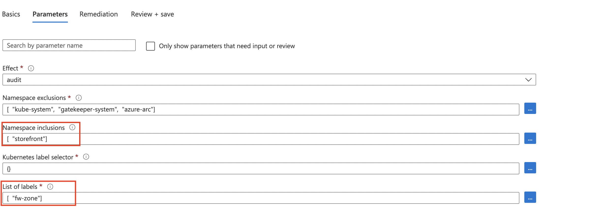

## Use the Azure Policy Add-on with a custom Azure Policy to verify the calicocloud/calico enterprise components

The following README will guide you on how to use a custom Azure Policy [Azure Policy for Kubernetes](https://docs.microsoft.com/en-us/azure/governance/policy/concepts/policy-for-kubernetes#:~:text=Azure%20Policy%20extends%20Gatekeeper%20v3,Kubernetes%20clusters%20from%20one%20place.) on an Azure Arc-connected Kubernetes cluster to verify whether [Calico network policy](https://projectcalico.docs.tigera.io/about/about-network-policy) is enabled or not.

> **Note: This guide assumes you already deployed an Amazon Elastic Kubernetes Service (EKS) or Google Kubernetes Engine (GKE) cluster and connected it to Azure Arc. If you haven't, this repository offers you a way to do so in an automated fashion using these couple of Jumpstart scenarios:
- [Deploy EKS cluster and connect it to Azure Arc using Terraform](https://azurearcjumpstart.io/azure_arc_jumpstart/azure_arc_k8s/eks/eks_terraform/)
- [Deploy GKE cluster and connect it to Azure Arc using Terraform](https://azurearcjumpstart.io/azure_arc_jumpstart/azure_arc_k8s/gke/gke_terraform/).**

## Prerequisites

* Clone the Azure Arc Jumpstart repository

    ```shell
    git clone https://github.com/microsoft/azure_arc.git
    ```

* [Install or update Azure CLI to version 2.25.0 and above](https://docs.microsoft.com/en-us/cli/azure/install-azure-cli?view=azure-cli-latest). Use the below command to check your current installed version.

  ```shell
  az --version
  ```

* As mentioned, this guide starts at the point where you already have a connected EKS/GKE cluster to Azure Arc.

    

    

* Before installing the Azure Policy Add-on or enabling any of the service features, your subscription must enable the _Microsoft.PolicyInsights_ resource provider and create a role assignment for the cluster service principal. To do that, open [Azure Cloud Shell](https://shell.azure.com/) and run either the Azure CLI or PowerShell command.

    

    Azure CLI:

    ```shell
    az provider register --namespace 'Microsoft.PolicyInsights'
    ```

    PowerShell:

    ```powershell
    Register-AzResourceProvider -ProviderNamespace 'Microsoft.PolicyInsights'
    ```

    To verify successful registration, run either the below Azure CLI or PowerShell command.

    Azure CLI:

    ```shell
    az provider show --namespace 'Microsoft.PolicyInsights'
    ```

    PowerShell:

    ```powershell
    Get-AzResourceProvider -ProviderNamespace 'Microsoft.PolicyInsights'
    ```

    


* Azure Policy installed in Azure Arc-Connected Cluster

 > by running the the ```kubectl get pods -n gatekeeper-system ``` command, you will notice all pods have been deployed.


## Deploy a customized Azure policy to verify if Calico Cloud or Calico Enterprise components are enabled in your Azure Arc-enabled Kubernetes cluster.

* In the Azure portal Search bar, look for _Policy_ and click on _Definitions_ which will show you all of the available Azure policies.

    

    

* Click on *+ Policy definition* to add a new policy. 

    

    

* In the above example, the *Definition location* of the policy represent the Azure subscription. Also, make sure *Category* is set to *Kubernetes*. We will use `audit` as default effect for this policy. 

  You can either copy the `calicoapipolicy.json` file located in this folder into `POLICY RULE` or create a policy directly with azure cli with below command.

  ```shell
  az policy definition create --name 'arcdemo-calicoapi-policy' --display-name 'Audit Calico api server' --description 'This policy audit that if calicocloud/calico enterprise components exist' --rules 'calicoapipolicy.json' --mode All
  ```

* Once the policy is been created, you should be able to find it in *Policy | Definitions* 
  
   need change
    

* Click the policy you created, and assign it to your resource group which include the arc clusters. Alternatively, you can assign the policy to entre Azure subscription.
  
   need change
  

* After the assignment, the policy task will start the evaluation against arc enabled cluster under your resource group. If you have 2 clusters installed calicocloud/calico enterprise, it will show as  "compliant" with `2 out of 2 ` (The gatekeeper will look for deployment with label 'apiserver' as audit labellist). To check this, go back to the main Policy page in the Azure portal.

    > **Note: The process of evaluation against the cluster can take 30min.**

    

    > If you create ks8 without enabling azure policy, then the audit result of this policy will be `0 out of 0` as `Compliant`


## Clean up environment

Complete the following steps to clean up your environment.

* From the Policy page in the arc eks/gke portal, disable the extension of Azure policy under "Onboard to Azure Policy for Azure Arc enabled Kubernetes clusters​"
    
    


* Delete the cluster as described in the [Terraform teardown instructions for eks](https://azurearcjumpstart.io/azure_arc_jumpstart/azure_arc_k8s/eks/eks_terraform/) or [Terraform teardown instructions for gke](https://azurearcjumpstart.io/azure_arc_jumpstart/azure_arc_k8s/gke/gke_terraform/) .


