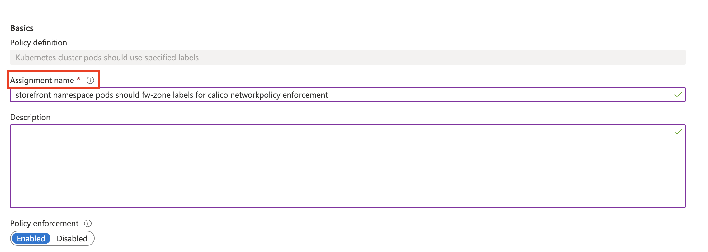

## Use the Azure Policy on a Azure-Arc enabled Kubernetes cluster for applying ingress/egress rules. 

Calico Network Policy uses labels to select pods in Kubernetes for applying ingress/egress rules. 
In this scenario, we will be using Azure Policy on an Azure-Arc enabled Kubernetes cluster to check whether the “fw-zone” label is present on pods in the “storefront” namespace.
The policy will be set to “Audit” mode to check the configuration of existing clusters (it can also be set to “Deny” mode to avoid any future misconfigurations)


The following README will guide you on how to use a Azure Policy [Azure Policy for Kubernetes](https://docs.microsoft.com/en-us/azure/governance/policy/concepts/policy-for-kubernetes#:~:text=Azure%20Policy%20extends%20Gatekeeper%20v3,Kubernetes%20clusters%20from%20one%20place.) on an Azure Arc-connected Kubernetes cluster to audit/enforce label for pods as [network policy](https://projectcalico.docs.tigera.io/about/about-network-policy) are applied to pods using label selectors.

> **Note: This guide assumes you already deployed an Amazon Elastic Kubernetes Service (EKS) or Google Kubernetes Engine (GKE) cluster and connected it to Azure Arc. If you haven't, this repository offers you a way to do so in an automated fashion using these couple of Jumpstart scenarios:
- [Deploy EKS cluster and connect it to Azure Arc using Terraform](https://azurearcjumpstart.io/azure_arc_jumpstart/azure_arc_k8s/eks/eks_terraform/)
- [Deploy GKE cluster and connect it to Azure Arc using Terraform](https://azurearcjumpstart.io/azure_arc_jumpstart/azure_arc_k8s/gke/gke_terraform/).**

## Prerequisites

* Clone the Azure Arc Jumpstart repository

    ```shell
    git clone https://github.com/microsoft/azure_arc.git
    ```

* [Install or update Azure CLI to version 2.25.0 and above](https://docs.microsoft.com/en-us/cli/azure/install-azure-cli?view=azure-cli-latest). Use the below command to check your current installed version.

  ```shell
  az --version
  ```

* As mentioned, this guide starts at the point where you already have a connected EKS/GKE cluster to Azure Arc.

    

    

* Before installing the Azure Policy Add-on or enabling any of the service features, your subscription must enable the _Microsoft.PolicyInsights_ resource provider and create a role assignment for the cluster service principal. To do that, open [Azure Cloud Shell](https://shell.azure.com/) and run either the Azure CLI or PowerShell command.

    

    Azure CLI:

    ```shell
    az provider register --namespace 'Microsoft.PolicyInsights'
    ```

    PowerShell:

    ```powershell
    Register-AzResourceProvider -ProviderNamespace 'Microsoft.PolicyInsights'
    ```

    To verify successful registration, run either the below Azure CLI or PowerShell command.

    Azure CLI:

    ```shell
    az provider show --namespace 'Microsoft.PolicyInsights'
    ```

    PowerShell:

    ```powershell
    Get-AzResourceProvider -ProviderNamespace 'Microsoft.PolicyInsights'
    ```

    


* Azure Policy installed in Azure Arc-Connected Cluster

 > by running the the ```kubectl get pods -n gatekeeper-system ``` command, you will notice all pods have been deployed.


## Deploy a Azure policy to verify if “fw-zone” label exist in each pods. 

* In the Azure portal Search bar, look for _Policy_ and click on _Definitions_ which will show you all of the available Azure policies.

    

    

* Click on _Category_ to search a build-in policy. 

    

* In the below example, make sure _Category_ is set to _Kubernetes_ only, and type `label` in _Search_, you will find `Kubernetes cluster pods should use specified labels` in _BuiltIn_ Type.

    
    

* Click this policy, and assign it to your Azure resource group which includes the Azure Arc-enabled Kubernetes clusters. Alternatively, you can assign the policy to entre Azure subscription.
  
   


* After the assignment, the policy task will start the evaluation against arc enabled cluster under your resource group. If you have 2 clusters installed calicocloud/calico enterprise, it will show as  "compliant" with `2 out of 2 ` (The gatekeeper will look for deployment with label 'apiserver' as audit labellist). To check this, go back to the main Policy page in the Azure portal.

    > **Note: The process of evaluation against the cluster can take 30min.**

    

    > If you create ks8 without enabling azure policy, then the audit result of this policy will be `0 out of 0` as `Compliant`


## Clean up environment

Complete the following steps to clean up your environment.

* From the Policy page in the arc eks/gke portal, disable the extension of Azure policy under "Onboard to Azure Policy for Azure Arc enabled Kubernetes clusters​"
    
    


* Delete the cluster as described in the [Terraform teardown instructions for eks](https://azurearcjumpstart.io/azure_arc_jumpstart/azure_arc_k8s/eks/eks_terraform/) or [Terraform teardown instructions for gke](https://azurearcjumpstart.io/azure_arc_jumpstart/azure_arc_k8s/gke/gke_terraform/) .


