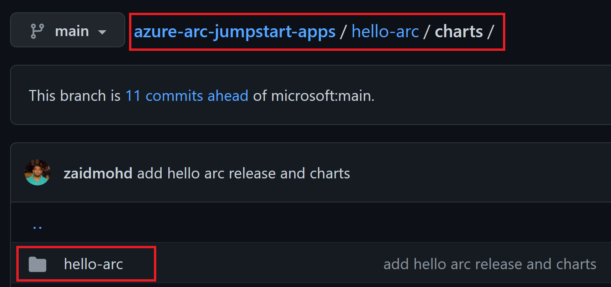
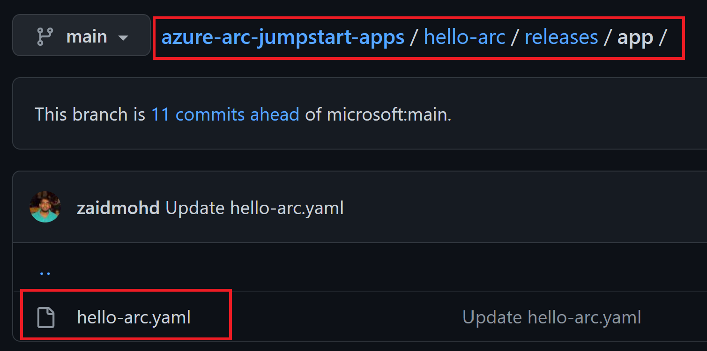
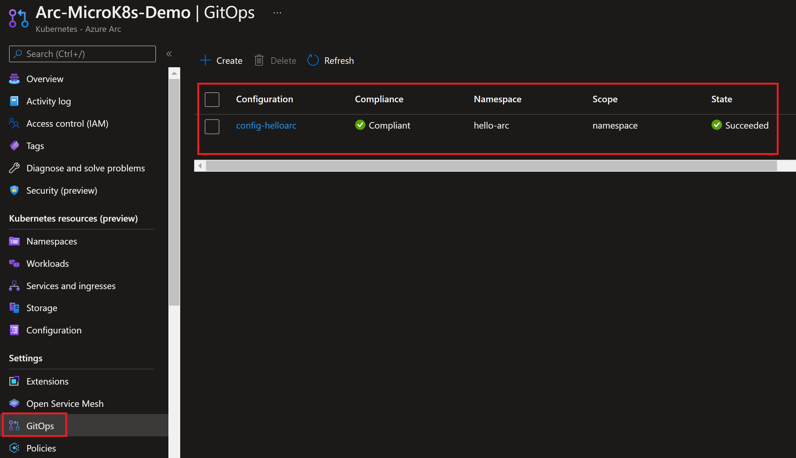

## Deploy GitOps configurations and perform Helm-based GitOps flow on MicroK8s as an Azure Arc Connected Cluster

The following Jumpstart scenario will guide you on how to create [Helm](https://helm.sh/)-based GitOps configuration on a [MicroK8s](https://microk8s.io/) cluster which is projected as an Azure Arc connected cluster resource.

in this scenario, you will first deploy a nginx ingress controller to your cluster. Then you will deploy & attach a GitOps configuration to your cluster. This will be a namespace-level config to deploy the "Hello Arc" web application on your Kubernetes cluster.

By doing so, you will be able to make real-time changes to the application and show how the GitOps flow takes effect.

> **NOTE: This guide assumes you already deployed MicroK8s and connected it to Azure Arc. If you haven't, this repository offers you a way to do so in the [MicroK8s onboarding guide](https://azurearcjumpstart.io/azure_arc_jumpstart/azure_arc_k8s/microk8s/local_microk8s/).**

## Prerequisites

* Clone the Azure Arc Jumpstart repository

    ```shell
    git clone https://github.com/microsoft/azure_arc.git
    ```

* Fork the ["Hello Arc"](https://github.com/likamrat/hello_arc) demo application repository.

* (Optional) Install the "Tab Auto Refresh" extension for your browser. This will help you to show the real-time changes on the application in an automated way.

  * [Microsoft Edge](https://microsoftedge.microsoft.com/addons/detail/odiofbnciojkpogljollobmhplkhmofe)

  * [Google Chrome](https://chrome.google.com/webstore/detail/tab-auto-refresh/jaioibhbkffompljnnipmpkeafhpicpd?hl=en)

  * [Mozilla Firefox](https://addons.mozilla.org/firefox/addon/tab-auto-refresh/)

* As mentioned, this guide starts at the point where you already have a connected MicroK8s cluster to Azure Arc.

    

    

* [Install or update Azure CLI to version 2.25.0 and above](https://docs.microsoft.com/cli/azure/install-azure-cli?view=azure-cli-latest). Use the below command to check your current installed version.

  ```shell
  az --version
  ```

* Create Azure service principal (SP)

    To be able to complete the scenario and its related automation, Azure service principal assigned with the “Contributor” role is required. To create it, login to your Azure account run the below command (this can also be done in [Azure Cloud Shell](https://shell.azure.com/)).

    ```shell
    az login
    subscriptionId=$(az account show --query id --output tsv)
    az ad sp create-for-rbac -n "<Unique SP Name>" --role "Contributor" --scopes /subscriptions/$subscriptionId
    ```

    For example:

    ```shell
    az login
    subscriptionId=$(az account show --query id --output tsv)
    az ad sp create-for-rbac -n "JumpstartArcK8s" --role "Contributor" --scopes /subscriptions/$subscriptionId
    ```

    Output should look like this:

    ```json
    {
    "appId": "XXXXXXXXXXXXXXXXXXXXXXXXXXXX",
    "displayName": "JumpstartArcK8s",
    "password": "XXXXXXXXXXXXXXXXXXXXXXXXXXXX",
    "tenant": "XXXXXXXXXXXXXXXXXXXXXXXXXXXX"
    }
    ```

    > **NOTE: If you create multiple subsequent role assignments on the same service principal, your client secret (password) will be destroyed and recreated each time. Therefore, make sure you grab the correct password**.

    > **NOTE: The Jumpstart scenarios are designed with as much ease of use in-mind and adhering to security-related best practices whenever possible. It is optional but highly recommended to scope the service principal to a specific [Azure subscription and resource group](https://docs.microsoft.com/cli/azure/ad/sp?view=azure-cli-latest) as well considering using a [less privileged service principal account](https://docs.microsoft.com/azure/role-based-access-control/best-practices)**

* Export MicroK8s config

    You can export MicroK8s cluster config to a file and use `kubectl` directly instead of `microk8s kubectl` command.

  * Windows

    ```shell
    microk8s config view > %HOMEPATH%\.kube\microk8s
    ```

  * Linux

    ```shell
    microk8s config view > ~/.kube/microk8s
    ```

* From this point forward, this guide assumes you have exported MicroK8s config file and have set it in kubectl using `--kubeconfig` flag or `$KUBECONFIG` environment variable. More information can be found in [Organizing Cluster Access Using kubeconfig Files](https://kubernetes.io/docs/concepts/configuration/organize-cluster-access-kubeconfig/).

## Manually setting up an ingress controller on MicroK8s

The demo application that will be deployed later in this scenario relies on an ingress controller. Given that MicroK8s needs [Multipass](https://multipass.run/) on Windows and MacOS, we'll be covering that scenario and assuming Multipass is running.

## NGINX Controller Deployment

* Run the following command to install the nginx ingress controller on MicroK8s:

    ```shell
    kubectl apply -f https://raw.githubusercontent.com/kubernetes/ingress-nginx/controller-v0.35.0/deploy/static/provider/baremetal/deploy.yaml
    ```

* This command will create a new namespace and deploy the required components in this namespace. To verify the deployment of the ingress controller was successful, make sure the pod with name `ingress-nginx-controller-<random id>-<random id>` is in a running state with 1/1 containers ready and that a service has been exposed as NodePort.

    ```shell
    kubectl get pods -n ingress-nginx
    ```

    

    ```shell
    kubectl get svc -n ingress-nginx
    ```

    

* Take note of the port where the ingress has been exposed (in the image above it was assigned port **32106**). We now need to get the IP address assigned to our microk8s-vm instance in multipass:

    ```shell
    multipass list
    ```

    

* Combining the IP address from multipass and the NodePort assigned to the ingress controller, we can now test that the NGINX ingress controller has been deployed successfully. In our case, the full address becomes *`http://172.22.206.155:32106`*.

* Using the below in your browser or command line, should get you with a HTTP 404 response with a nginx footer. This shows that the ingress is working. The 404 response is to be expected since you haven't setup an ingress route yet. You will do that in the next section.

    

    

## Cluster-level Config vs. Namespace-level Config

### Cluster-level Config

With Cluster-level GitOps config, the goal is to have "horizontal components" or "management components" deployed on your Kubernetes cluster which will then be used by your applications. Good examples are Service Meshes, Security products, Monitoring solutions, etc.

> **NOTE: You will not be creating a cluster-level config in this scenario. For an example of a cluster-level configuration please refer to either the [Helm-based GitOps on AKS scenario](https://azurearcjumpstart.io/azure_arc_jumpstart/azure_arc_k8s/day2/aks/aks_gitops_helm/) or the [GKE one](https://azurearcjumpstart.io/azure_arc_jumpstart/azure_arc_k8s/day2/gke/gke_gitops_helm/).**

### Namespace-level Config

With Namespace-level GitOps config, the goal is to have Kubernetes resources deployed only in the namespace selected. The most obvious use-case here is simply your application and its respective pods, services, ingress routes, etc. In the next section will have the "Hello Arc" application deployed on a dedicated namespace.

## Azure Arc Kubernetes GitOps Configuration with Helm

### The Mechanism (In a nutshell)

In the process of creating Azure Arc-enabled Kubernetes GitOps configuration, [Weaveworks Flux Kubernetes Operator](https://github.com/fluxcd/flux) is deployed on the cluster.

The Operator is aware of the "HelmRelease" Custom Resource Definition (CRD). This HelmRelease points to a HELM chart in a git repo and can optionally contain specific values to input into the helm chart. Due to this configuration, a user can choose to leave the chart values intact or to have different values for different releases.

For example, an application (captured in an Helm chart) dev release can have no pod replication (single pod) while a production release, using the same chart can have 3 pod replicas.

In the next section will use the "Hello Arc" Helm chart to deploy a production release which we will then change and see the results in real-time.

### Deployment Flow

For our scenario, we will deploy the "Hello Arc" application from the ["demo repository"](https://github.com/likamrat/hello_arc) through GitOps. We will deploy the "Hello Arc" application (a Namespace-level component) with 1 replica to the *prod* namespace.




### Deployment

To create the GitOps configuration and it's respective Kubernetes resources, we've provided a script in a shell file (Linux, MacOS) and batch file (Windows).

* Linux and MacOS

    Edit the environment variables in the [*az_k8sconfig_helm_microk8s*](https://github.com/microsoft/azure_arc/blob/main/azure_arc_k8s_jumpstart/microk8s/gitops/helm/az_k8sconfig_helm_microk8s.sh) shell script to match your parameters, and run the below command.

    ```shell
    . ./az_k8sconfig_helm_microk8s.sh
    ```

    > **NOTE: The extra dot is due to the script having an *export* function and that needs to have the vars exported in the same shell session as the rest of the commands.**

* Windows

    Edit the environment variables in the [*az_k8sconfig_helm_microk8s_windows*](https://github.com/microsoft/azure_arc/blob/main/azure_arc_k8s_jumpstart/microk8s/gitops/helm/az_k8sconfig_helm_microk8s_windows.ps1) PowerShell file to match your parameters, and run it using the ```.\az_k8sconfig_helm_microk8s.ps1``` command.

The `az_k8sconfig_helm_microk8s` and `az_k8sconfig_helm_microk8s_windows` scripts will:

* Login to your Azure subscription using the SPN credentials.
* Create the GitOps configurations for the Azure Arc Connected Cluster. The configuration will be using the Helm chart located in the "Hello Arc" repository. This will create a namespace-level config to deploy the "Hello Arc" application Helm chart.

    > **Disclaimer: For the purpose of this guide, notice how the "*git-poll-interval 3s*" is set. The 3 seconds interval is useful for demo purposes since it will make the git-poll interval to rapidly track changes on the repository but it is recommended to have longer interval in your production environment (default value is 5min)**

* Once the script will complete its run, you will have the GitOps configuration created and all the resources deployed in your local MicroK8s Kubernetes cluster.

    > **NOTE: it can take a few minutes for the configuration to change its Operator state status from "Pending" to "Installed".**

    

    

* The Namespace-level config initiated the "Hello Arc" Pod (1 replica), Service and Ingress Route resource deployment.

    ```shell
    kubectl get pods -n prod
    kubectl get svc -n prod
    kubectl get ing -n prod
    ```

    

## Initiating "Hello Arc" Application GitOps

* The GitOps flow works as follow:

    1. The Flux operator holds the "desired state" of the "Hello Arc" Helm release. This is the configuration we deployed against the Azure Arc connected cluster. The operator will pull the state of the releases in the repository every 3 seconds.

    2. Changing the application release will trigger the Flux operator to kick-in the GitOps flow. In our case, we will be changing the welcome message and the amount of replicas.

    3. A new version of the application will be deployed on the cluster with more replicas as configured. Once the new pods are successfully deployed, the old ones will be terminated (rolling upgrade).

* To show the above flow, open 2 (ideally 3) side-by-side windows:

  * Local shell running ```kubectl get pods -n prod -w```

  * In your own repository fork, open the "Hello Arc" [*hello-arc.yaml*](https://github.com/likamrat/hello_arc/blob/master/releases/prod/hello-arc.yaml) Helm release file.

  * Another browser window that has the webpage <http://172.22.206.155:32106> open **(replace with your own values)**  

  * End result should look like this:

    

* As mentioned in the prerequisites section, it is optional but very recommended to configure the "Tab Auto Refresh" extension for your browser. If you did, in the "Hello Arc" application window, configure it to refresh every 2 seconds.

    

* In the repository window showing the *hello-arc.yaml* file, change the number of *replicaCount* to 3 as well as the the message text and commit your changes. Alternatively, you can open the forked repository in your IDE, make the change, commit and push it.

    

* Upon committing the changes, notice how the rolling upgrade starts. Once the Pods are up & running, the new "Hello Arc" application version window will show the new messages as well as the additional pods replicas, showing the rolling upgrade is completed and the GitOps flow is successful.

    

    

    

## Cleanup

To delete the GitOps configuration and it's respective Kubernetes resources, we've provided a script in a shell file (Linux, MacOS) and a PowerShell file (Windows). It is recommended to run this script locally, since it also removes elements from the local cluster.

* Linux and MacOS

    Edit the environment variables to match the Azure Arc Kubernetes cluster and Resources in the [az_k8sconfig_helm_cleanup_microk8s](https://github.com/microsoft/azure_arc/blob/main/azure_arc_k8s_jumpstart/microk8s/gitops/helm/az_k8sconfig_helm_cleanup_microk8s.sh) shell script, then run the file:

    ```shell
    ./az_k8sconfig_helm_cleanup_microk8s.sh
    ```

* Windows

    Edit the environment variables to match the Azure Arc Kubernetes cluster and Resources in the [az_k8sconfig_helm_cleanup_microk8s_windows](https://github.com/microsoft/azure_arc/blob/main/azure_arc_k8s_jumpstart/microk8s/gitops/helm/az_k8sconfig_helm_cleanup_microk8s_windows.ps1) script, then run the file:

    ```shell
    .\az_k8sconfig_helm_cleanup_microk8s_windows.ps1
    ```

* You should see the resources being deleted:

    

* If you also wish to remove the local MicroK8s cluster and the Arc connected cluster from Azure, please refer to the [Delete the Deployment section](https://github.com/microsoft/azure_arc/blob/main/azure_arc_k8s_jumpstart/microk8s/gitops/helm/az_k8sconfig_helm_cleanup_microk8s_windows.ps1) in the onboarding guide.
