## Deploy GitOps configurations and perform Helm-based GitOps flow on MicroK8s as an Azure Arc Connected Cluster (Flux v2)

The following Jumpstart scenario will guide you on how to create [Helm](https://helm.sh/)-based GitOps configuration on a [MicroK8s](https://microk8s.io/) cluster which is projected as an Azure Arc connected cluster resource.

In this scenario, you will deploy [nginx-ingress controller](https://kubernetes.github.io/ingress-nginx/) and a namespace-level config to deploy the "Hello Arc" web application on your Kubernetes cluster. By doing so, you will be able to make real-time changes to the application and show how the GitOps flow takes effect.

GitOps on Azure Arc-enabled Kubernetes uses [Flux](https://fluxcd.io/docs/), a popular open-source toolset. Flux is a tool for keeping Kubernetes clusters in sync with sources of configuration (like Git repositories) and automating updates to the configuration when there is new code to deploy. The Flux toolkit component Helm Controller is a Kubernetes operator, allowing one to declaratively manage Helm chart releases with Kubernetes manifests. The Operator is aware of the “HelmRelease” Custom Resource Definition (CRD). This _HelmRelease_ points to a helm chart in a git repo and can optionally contain specific values to input into the helm chart.

> **NOTE: This guide assumes you already deployed MicroK8s and connected it to Azure Arc. If you haven't, this repository offers you a way to do so in the [MicroK8s onboarding guide](https://azurearcjumpstart.io/azure_arc_jumpstart/azure_arc_k8s/microk8s/local_microk8s/).**

## Prerequisites

- Fork the ["Azure Arc Jumpstart Apps"](https://github.com/microsoft/azure-arc-jumpstart-apps) repository. In this scenario, you will be making changes on your own forked repository to initiate the GitOps flow.

- (Optional) Install the "Tab Auto Refresh" extension for your browser. This will help you to show the real-time changes on the application in an automated way.

  - [Microsoft Edge](https://microsoftedge.microsoft.com/addons/detail/odiofbnciojkpogljollobmhplkhmofe)

  - [Google Chrome](https://chrome.google.com/webstore/detail/tab-auto-refresh/jaioibhbkffompljnnipmpkeafhpicpd?hl=en)

  - [Mozilla Firefox](https://addons.mozilla.org/firefox/addon/tab-auto-refresh/)

- As mentioned, this scenario starts at the point where you already have a connected MicroK8s cluster to Azure Arc.

    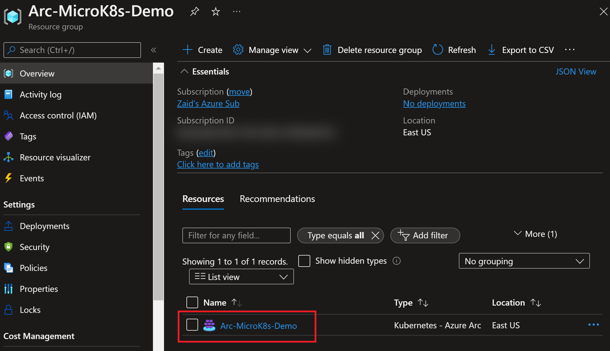

    

- [Install or update Azure CLI to version 2.36.0 and above](https://docs.microsoft.com/cli/azure/install-azure-cli?view=azure-cli-latest). Use the below command to check your current installed version.

  ```shell
  az --version
  ```

- Create Azure service principal (SP)

    To be able to complete the scenario and its related automation, Azure service principal assigned with the “Contributor” role is required. To create it, login to your Azure account run the below command (this can also be done in [Azure Cloud Shell](https://shell.azure.com/)).

    ```shell
    az login
    subscriptionId=$(az account show --query id --output tsv)
    az ad sp create-for-rbac -n "<Unique SP Name>" --role "Contributor" --scopes /subscriptions/$subscriptionId
    ```

    For example:

    ```shell
    az login
    subscriptionId=$(az account show --query id --output tsv)
    az ad sp create-for-rbac -n "JumpstartArcK8s" --role "Contributor" --scopes /subscriptions/$subscriptionId
    ```

    Output should look like this:

    ```json
    {
    "appId": "XXXXXXXXXXXXXXXXXXXXXXXXXXXX",
    "displayName": "JumpstartArcK8s",
    "password": "XXXXXXXXXXXXXXXXXXXXXXXXXXXX",
    "tenant": "XXXXXXXXXXXXXXXXXXXXXXXXXXXX"
    }
    ```

    > **NOTE: If you create multiple subsequent role assignments on the same service principal, your client secret (password) will be destroyed and recreated each time. Therefore, make sure you grab the correct password**.

    > **NOTE: The Jumpstart scenarios are designed with as much ease of use in-mind and adhering to security-related best practices whenever possible. It is optional but highly recommended to scope the service principal to a specific [Azure subscription and resource group](https://docs.microsoft.com/cli/azure/ad/sp?view=azure-cli-latest) as well considering using a [less privileged service principal account](https://docs.microsoft.com/azure/role-based-access-control/best-practices)**

- Export MicroK8s config

    You can export MicroK8s cluster config to a file and use `kubectl` directly instead of `microk8s kubectl` command.

  - Windows

    ```shell
    microk8s config view > %HOMEPATH%\.kube\microk8s
    ```

  - Linux

    ```shell
    microk8s config view > ~/.kube/microk8s
    ```

- From this point forward, this guide assumes you have exported MicroK8s config file and have set it in kubectl using `--kubeconfig` flag or `$KUBECONFIG` environment variable. More information can be found in [Organizing Cluster Access Using kubeconfig Files](https://kubernetes.io/docs/concepts/configuration/organize-cluster-access-kubeconfig/).

## Manually setting up an ingress controller on MicroK8s

The demo application that will be deployed later in this scenario relies on an ingress controller. Given that MicroK8s needs [Multipass](https://multipass.run/) on Windows and MacOS, we'll be covering that scenario and assuming Multipass is running.

### NGINX Controller Deployment

- Run the following command to install the nginx ingress controller on MicroK8s:

    ```shell
    kubectl apply -f https://raw.githubusercontent.com/kubernetes/ingress-nginx/controller-v1.3.0/deploy/static/provider/baremetal/deploy.yaml
    ```

- This command will create a new namespace and deploy the required components in this namespace. To verify the deployment of the ingress controller was successful, make sure the pod with name `ingress-nginx-controller-<random id>-<random id>` is in a running state with 1/1 containers ready and that a service has been exposed as NodePort.

    ```shell
    kubectl get pods -n ingress-nginx
    ```

    

    ```shell
    kubectl get svc -n ingress-nginx
    ```

    

- Take note of the port where the ingress has been exposed (in the image above it was assigned port **32046**). We now need to get the IP address assigned to our microk8s-vm instance in multipass:

    ```shell
    multipass list
    ```

    

- Combining the IP address from multipass and the NodePort assigned to the ingress controller, we can now test that the NGINX ingress controller has been deployed successfully. In our case, the full address becomes _`http://172.19.174.107:32046`_.

- Using the below in your browser or command line, should get you with a HTTP 404 response with a nginx footer. This shows that the ingress is working. The 404 response is to be expected since you haven't setup an ingress route yet. You will do that in the next section.

    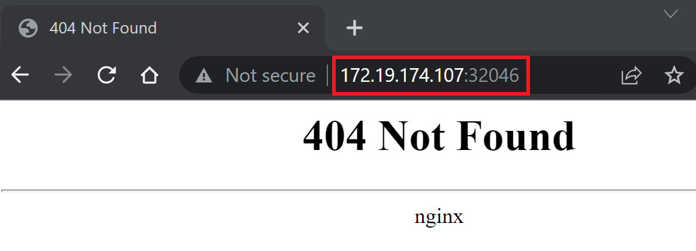

    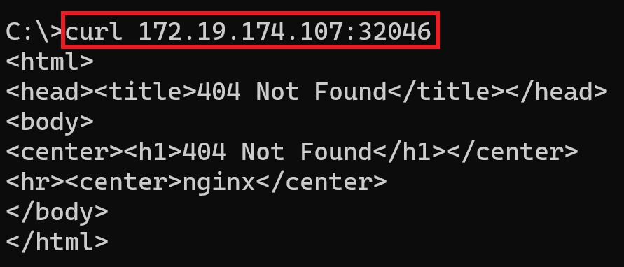

## Automation Flow

For you to get familiar with the automation and deployment flow, below is an explanation.

- User has deployed the Microk8s cluster and has it connected as an Azure Arc-enabled Kubernetes cluster.

- User has deployed the NGINX Ingress Controller

- User is editing the environment variables in the script file (1-time edit) which then be used throughout the GitOps configuration.

- User is running the script. The script will use the extension management feature of Azure Arc to deploy the Flux extension and create GitOps configuration on the Azure Arc-connected Kubernetes cluster.

- The GitOps configuration will create the namespace and deploy Hello-Arc application.

- User is verifying the cluster and making sure the extension and GitOps configuration is deployed.

- User is making an edit on the GitHub repo that will cause Flux GitOps to detect this change and trigger an update to the pod deployment.

## Cluster-level Config vs. Namespace-level Config

### Cluster-level Config

With Cluster-level GitOps config, the goal is to have an "horizontal components" or "management components" deployed on your Kubernetes cluster which will then be used by your applications. Good examples are Service Meshes, Security products, Monitoring solutions, etc. A very popular example will also be Ingress Controller which is exactly the nginx-ingress controller we will deploy in the next section.

### Namespace-level Config

With Namespace-level GitOps config, the goal is to have Kubernetes resources deployed only in the namespace selected. The most obvious use-case here is simply your application and it's respective pods, services, ingress routes, etc. In the next section will have the "Hello Arc" application deployed on a dedicated namespace.

## Azure Arc Kubernetes GitOps Configuration with Helm

To create the GitOps Configuration, we will use the _`k8s-configuration flux create`_ command while passing in values for the mandatory parameters. This scenario provides you with the automation to configure the GitOps on your Azure Arc-enabled Kubernetes cluster.

- In the screenshot below, notice how currently there is no GitOps configuration in your Arc-enabled Kubernetes cluster.

    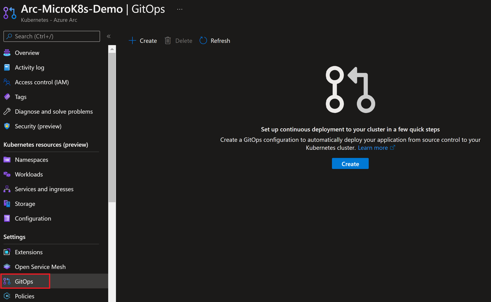

### Deployment Flow

For our scenario, notice we have Helm chart in the "Azure Arc Jumpstart Apps" repository for the Hello-Arc application as well as the Helm Release.


- The "Hello Arc" application (a Namespace-level component) will be deployed with 3 replica to the _hello-arc_ namespace.

### Deployment

To create the GitOps configuration and it's respective Kubernetes resources, we've provided a script in a shell file (Linux, MacOS) and batch file (Windows).

- Linux and MacOS

    Edit the environment variables in the [_az_k8sconfig_helm_microk8s_](https://github.com/microsoft/azure_arc/blob/main/azure_arc_k8s_jumpstart/microk8s/gitops/helm/az_k8sconfig_helm_microk8s.sh) shell script to match your parameters, and run the below command.

    ```shell
    . ./az_k8sconfig_helm_microk8s.sh
    ```

    > **NOTE: The extra dot is due to the script having an _export_ function and that needs to have the vars exported in the same shell session as the rest of the commands.**

- Windows

    Edit the environment variables in the [_az_k8sconfig_helm_microk8s_windows_](https://github.com/microsoft/azure_arc/blob/main/azure_arc_k8s_jumpstart/microk8s/gitops/helm/az_k8sconfig_helm_microk8s_windows.ps1) PowerShell file to match your parameters, and run it using the ```.\az_k8sconfig_helm_microk8s.ps1``` command.

    For example:

    

    The `az_k8sconfig_helm_microk8s` and `az_k8sconfig_helm_microk8s_windows` scripts will:

  - Login to your Azure subscription using the SPN credentials
  - Retrieve the cluster credentials (KUBECONFIG)
  - Create the GitOps configuration to deploy the Flux controllers and the ["Hello Arc"](https://github.com/microsoft/azure-arc-jumpstart-apps/blob/main/hello-arc) application alongside an Ingress rule to make it available from outside the cluster

    > **Disclaimer: For the purpose of this guide, notice how the "_sync-interval 3s_" is set. The 3 seconds interval is useful for demo purposes since it will make the sync interval rapidly track changes on the repository but it is recommended to have a longer interval in your production environment (the default value is 5min)**

- Once the script will complete it's run, you will have the GitOps configuration create all the resources deployed in your Kubernetes cluster. **NOTE:** that it takes a few min for the configuration to change status from "Pending" to Installed.

    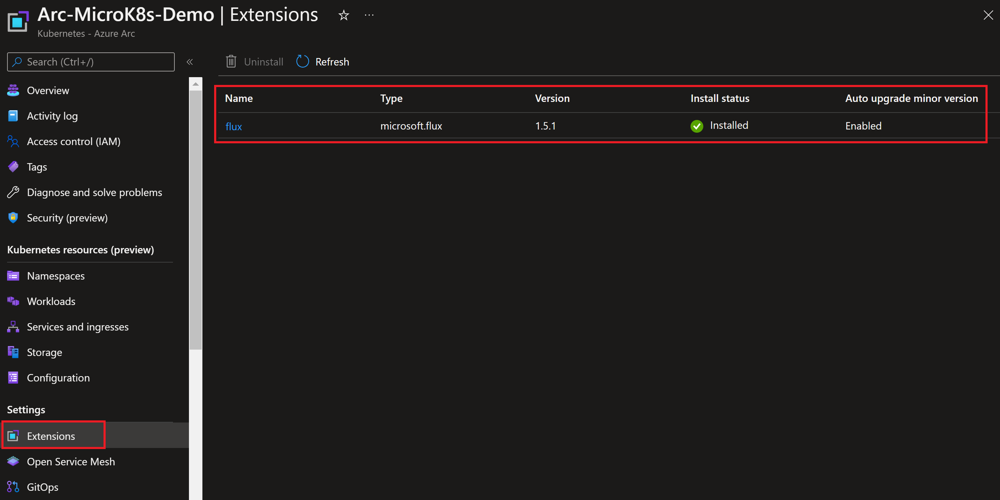

    

    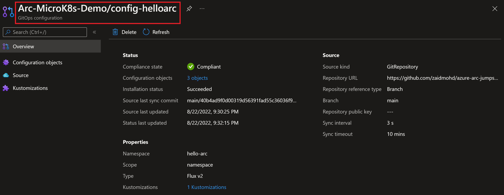

## The "Hello Arc" Application & Components

- Before kicking off the GitOps flow, let's verify and "zoom in" to the Kubernetes resources deployed by running a few _kubectl_ commands.

- Show the Flux operator pods.

    ```shell
    kubectl get pods -n flux-system 
    ```

    

- Show 3 replicas and service of the "Hello Arc" application.

    ```shell
    kubectl get pods,svc -n hello-arc
    ```

    

- Show NGINX rule which will route the traffic to the "Hello Arc" application from outside the cluster.

    ```shell
    kubectl get ing -n hello-arc
    ```

    

## Initiating "Hello Arc" Application GitOps

- The GitOps flow works as follow:

    1. The Flux operator holds the "desired state" for the "Hello Arc" Helm release, this is the configuration we deployed against the Azure Arc connected cluster. The operator "polls" the state of the ["Hello Arc"](https://github.com/microsoft/azure-arc-jumpstart-apps/blob/main/hello-arc) application repository.

    2. Changing the application, which is considered to be a new version of it, will trigger the Flux operator to kick in the GitOps flow.

    3. A new Kubernetes pod with the new version of the application will be deployed on the cluster. Once the new pods are successfully deployed, the old one will be terminated (rolling upgrade).

- To show the above flow, open 2 (ideally 3) side-by-side windows:

  - Azure Cloud Shell running the command
  
      ```shell
      kubectl get pods -n hello-arc -w
      ```
  
    

  - In **your fork** of the "Azure Arc Jumpstart Apps" repository, open the _hello-arc.yaml_ file (/hello-arc/releases/app/hello-arc.yaml).

  - Another browser window that has the webpage <http://172.19.174.107:32046> open **(replace with your own values)**.

  - End result should look like that:

    

- As mentioned in the prerequisites section, it is optional but highly recommended to configure the "Tab Auto Refresh" extension for your browser. If you did, in the "Hello Arc" application window, configure it to refresh every 2 seconds.

    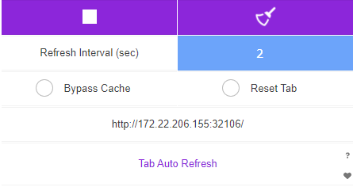

- In the repository window showing the _hello-arc.yaml_ file, change the text under the "MESSAGE" section commit the change. Alternatively, you can open your cloned repository in your IDE, make the change, commit and push it.

    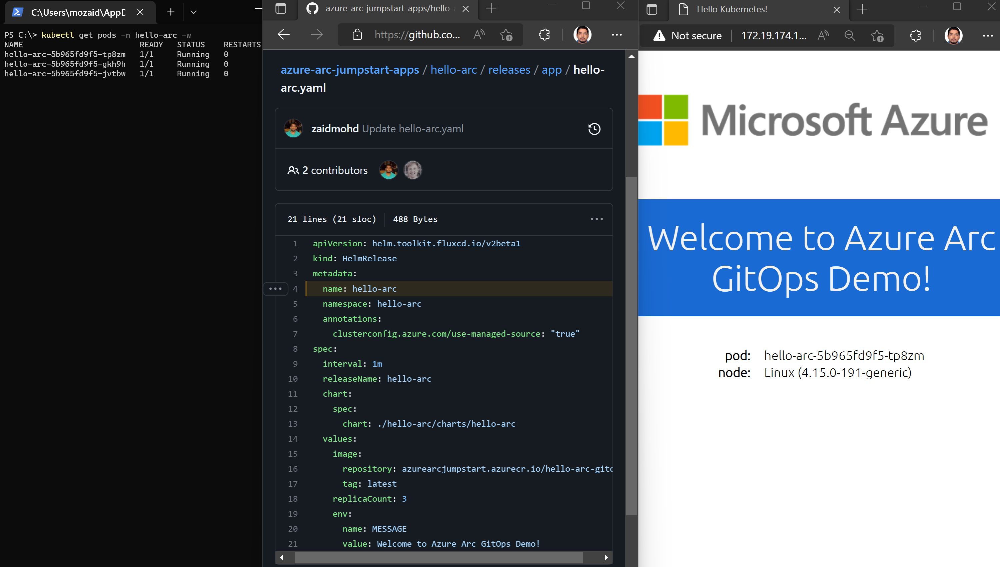

    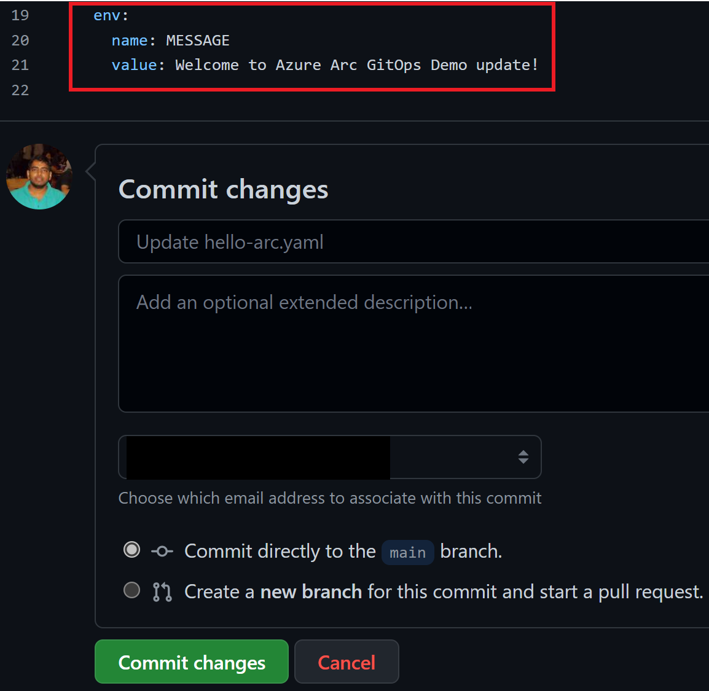

- Upon committing the changes, notice how the Kubernetes Pod rolling upgrade will start. Once the Pod is up & running, the new "Hello Arc" application version window will show the new message, showing the rolling upgrade is completed and the GitOps flow is successful.

    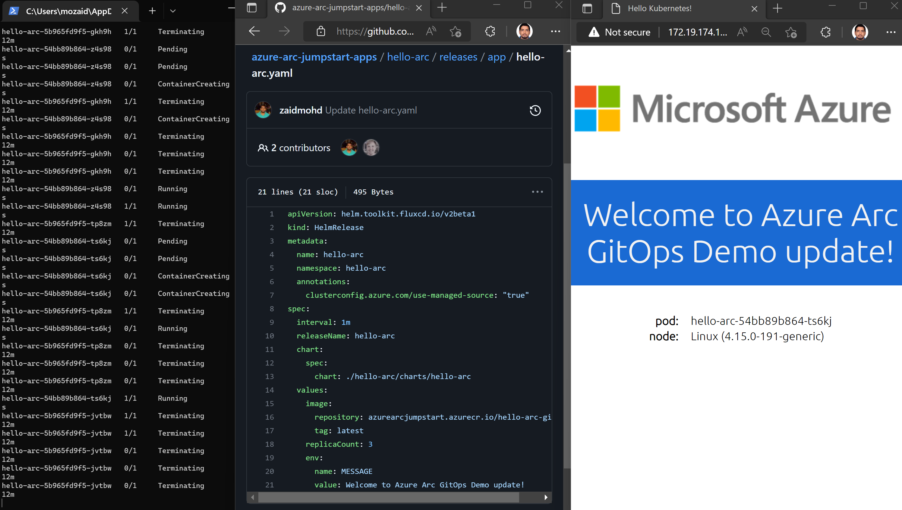

## Cleanup

To delete the GitOps configuration and it's respective Kubernetes resources, we've provided a script in a shell file (Linux, MacOS) and a PowerShell file (Windows). It is recommended to run this script locally, since it also removes elements from the local cluster.

- Linux and MacOS

    Edit the environment variables to match the Azure Arc Kubernetes cluster and Resources in the [az_k8sconfig_helm_cleanup_microk8s](https://github.com/microsoft/azure_arc/blob/main/azure_arc_k8s_jumpstart/microk8s/gitops/helm/az_k8sconfig_helm_cleanup_microk8s.sh) shell script, then run the file:

    ```shell
    ./az_k8sconfig_helm_cleanup_microk8s.sh
    ```

- Windows

    Edit the environment variables to match the Azure Arc Kubernetes cluster and Resources in the [az_k8sconfig_helm_cleanup_microk8s_windows](https://github.com/microsoft/azure_arc/blob/main/azure_arc_k8s_jumpstart/microk8s/gitops/helm/az_k8sconfig_helm_cleanup_microk8s_windows.ps1) script, then run the file:

    ```shell
    .\az_k8sconfig_helm_cleanup_microk8s_windows.ps1
    ```

- You should see the resources being deleted:

    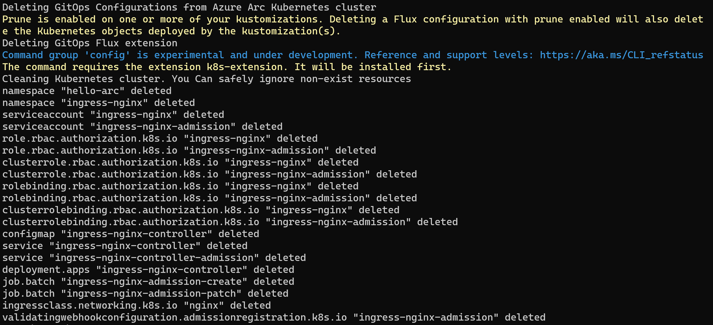

- If you also wish to remove the local MicroK8s cluster and the Arc connected cluster from Azure, please refer to the [Delete the Deployment section](https://azurearcjumpstart.io/azure_arc_jumpstart/azure_arc_k8s/microk8s/local_microk8s/#delete-the-deployment) in the onboarding guide.
