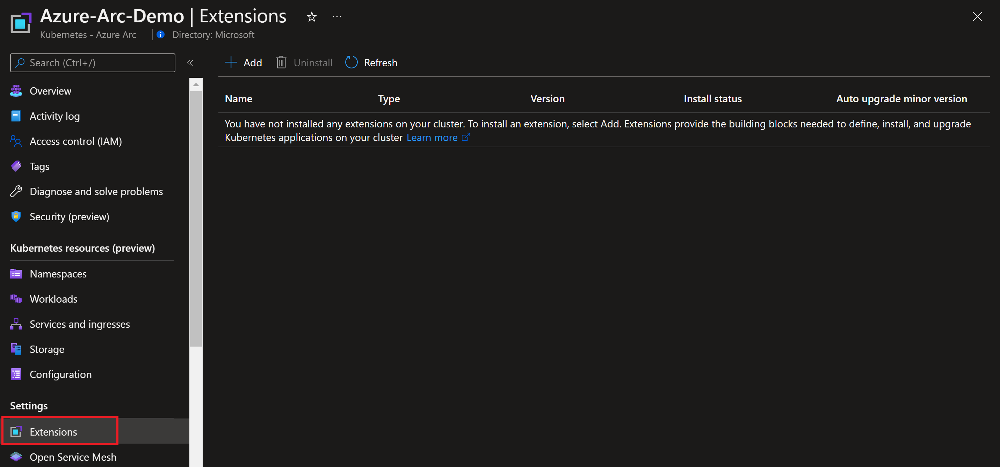
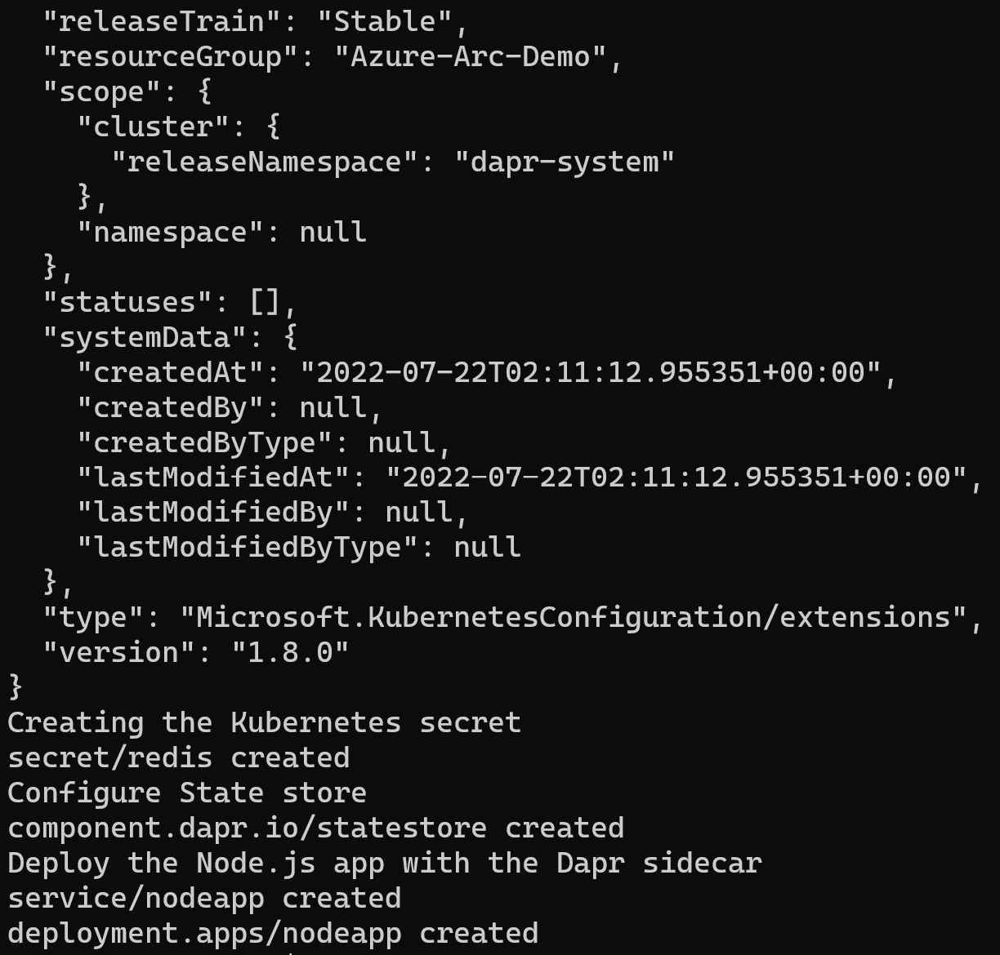
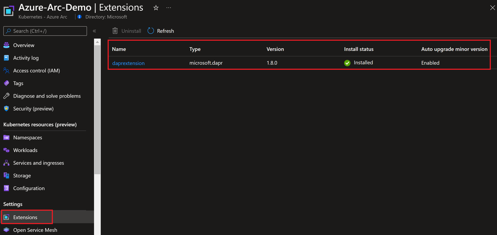
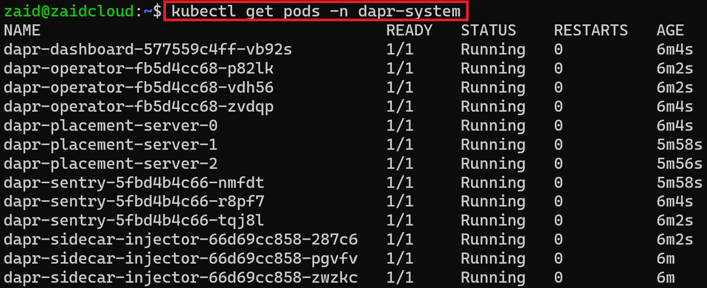
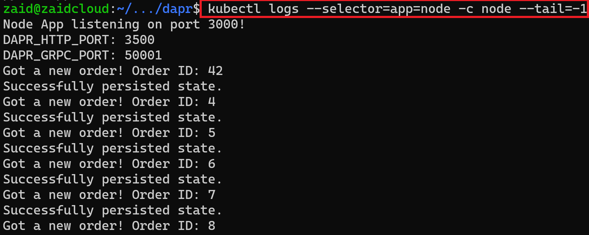

## Deploy an application using the Dapr Cluster extension for Azure Arc-enabled Kubernetes cluster

The following Jumpstart scenario will guide you on how to set up [Dapr](https://dapr.io/) for the Azure Arc-enabled Kubernetes cluster. In this scenario, you will enable Dapr by deploying the Dapr Cluster extension on your Azure Arc-enabled Kubernetes cluster alongside a Python application that generates messages and a Node.js application that consumes and persists them on [Azure Cache for Redis](https://docs.microsoft.com/azure/azure-cache-for-redis/cache-overview).

Dapr is a portable, event-driven runtime that makes it easy for any developer to build resilient, stateless, and stateful applications that run on the cloud and edge and embraces the diversity of languages and developer frameworks. Leveraging the benefits of a sidecar architecture, Dapr helps you tackle the challenges that come with building microservices and keeps your code platform agnostic.

> **NOTE: This guide assumes you already deployed a Kubernetes cluster and connected it to Azure Arc. If you haven't, this repository offers you a way to do so in an automated fashion for various [Kubernetes distributions](https://azurearcjumpstart.io/azure_arc_jumpstart/azure_arc_k8s/).**

## Prerequisites

- Clone the Azure Arc Jumpstart repository

    ```shell
    git clone https://github.com/microsoft/azure_arc.git
    ```

- As mentioned, this scenario starts at the point where you already have a connected Kubernetes cluster to Azure Arc.

    

    

- [Install or update Azure CLI to version 2.36.0 and above](https://docs.microsoft.com/cli/azure/install-azure-cli?view=azure-cli-latest). Use the below command to check your current installed version.

  ```shell
  az --version
  ```

- Create Azure service principal (SP)

    To be able to complete the scenario and its related automation, Azure service principal assigned with the “Contributor” role is required. To create it, login to your Azure account run the below command (this can also be done in [Azure Cloud Shell](https://shell.azure.com/)).

    ```shell
    az login
    subscriptionId=$(az account show --query id --output tsv)
    az ad sp create-for-rbac -n "<Unique SP Name>" --role "Contributor" --scopes /subscriptions/$subscriptionId
    ```

    For example:

    ```shell
    az login
    subscriptionId=$(az account show --query id --output tsv)
    az ad sp create-for-rbac -n "JumpstartArcK8s" --role "Contributor" --scopes /subscriptions/$subscriptionId
    ```

    Output should look like this:

    ```json
    {
    "appId": "XXXXXXXXXXXXXXXXXXXXXXXXXXXX",
    "displayName": "JumpstartArcK8s",
    "password": "XXXXXXXXXXXXXXXXXXXXXXXXXXXX",
    "tenant": "XXXXXXXXXXXXXXXXXXXXXXXXXXXX"
    }
    ```

    > **NOTE: If you create multiple subsequent role assignments on the same service principal, your client secret (password) will be destroyed and recreated each time. Therefore, make sure you grab the correct password**.

    > **NOTE: The Jumpstart scenarios are designed with as much ease of use in-mind and adhering to security-related best practices whenever possible. It is optional but highly recommended to scope the service principal to a specific [Azure subscription and resource group](https://docs.microsoft.com/cli/azure/ad/sp?view=azure-cli-latest) as well considering using a [less privileged service principal account](https://docs.microsoft.com/azure/role-based-access-control/best-practices)**

## Automation Flow

For you to get familiar with the automation and deployment flow, below is an explanation.

- User has deployed the Kubernetes cluster and connected it as an Azure Arc-enabled Kubernetes cluster.

- User is editing the environment variables in the below Shell script file (1-time edit) which then be used throughout the configuration.

- User is running the shell script. The script will use the extension management feature of Azure Arc to deploy the Dapr extension.

- The script will also create and configure the state store (Azure Cache for Redis), and deploy the Node.js app with the sidecar.

- User is verifying the cluster and ensuring the Dapr extension is deployed.

- User is verifying the service and confirming the order was persisted in the state store.

- Additionally, the User will deploy the Python app with the Dapr sidecar and observe messages to confirm successful persistence.

## Deployment

To create a new extension Instance, we will use the _k8s-extension create_ command while passing in values for the mandatory parameters. This scenario provides you with the automation to deploy the Dapr extension on your Azure Arc-enabled Kubernetes cluster.

> **NOTE: Before installing the Dapr extension, make sure that the _kubectl_ context is pointing to your Azure Arc-enabled Kubernetes cluster. To do that, you can refer to the [official Kubernetes documentation](https://kubernetes.io/docs/tasks/access-application-cluster/configure-access-multiple-clusters/) to find the options to change the kubecontext to different Kubernetes clusters.**


- In the screenshot below, notice how currently there are no extensions installed yet in your Arc-enabled Kubernetes cluster.

    

- Edit the environment variables [in the script](https://github.com/microsoft/azure_arc/blob/main/azure_arc_k8s_jumpstart/multi_distributions/dapr/dapr_k8s_statestore.sh) to match your environment parameters followed by running the _`. ./dapr_k8s_statestore.sh`_ command.

    

    

    > **NOTE: The extra dot is due to the shell script having an _export_ function and needs to have the vars exported in the same shell session as the rest of the commands.**

   The script will:

  - Login to your Azure subscription using the SPN credentials
  - Add or Update your local _k8s-extension_ Azure CLI extension
  - Create Resource Group, Redis store and Kubernetes Secret for the Redis Key
  - Create Dapr extension instance
  - Configure the state store on Kubernetes and deploy the Node app

- Once the script will complete it’s run, you can see that Dapr extension is now enabled in the extension tab section of the Azure Arc-enabled Kubernetes cluster resource in Azure. The script usually take 10-20 minutes to complete.

    

    

## Dapr Components & Node App

- Before validating the App, let’s verify and “zoom in” to the Kubernetes resources deployed by running a few kubectl commands.

    ```shell
    kubectl get pods -n dapr-system
    kubectl get component
    ```

    

    

- Show the Node App and Service, and make note of the External IP of the service.

    ```shell
    kubectl get pods,svc
    ```

    

    > **NOTE: The Dapr control plane will automatically inject the Dapr sidecar to the Pod, as the "dapr.io/enabled: true" annotation is added to the Node App deployment.**

- Verify the Node App service.

    ```shell
    export EXTERNAL_IP=<External IP>
    curl $EXTERNAL_IP/ports
    ```

    

- Navigate to the [dapr folder](https://github.com/microsoft/azure_arc/blob/main/azure_arc_k8s_jumpstart/multi_distributions/dapr/) and submit an order to the application.

    ```shell
    curl --request POST --data "@sample.json" --header Content-Type:application/json $EXTERNAL_IP/neworder
    ```

    

- Validate the order was persisted by requesting from the app.

    ```shell
    curl $EXTERNAL_IP/order
    ```

    

## Deploy the Python app with the Dapr sidecar

This is a basic [Python app](https://github.com/dapr/quickstarts/tree/master/tutorials/hello-world) that posts JSON messages to localhost:3500, which is the default listening port for Dapr. You can invoke the Node.js application's neworder endpoint by posting to v1.0/invoke/nodeapp/method/neworder. The message contains some data with an orderId that increments once per second.

- Deploy the Python App to your cluster.

    ```shell
    kubectl apply -f python.yaml
    kubectl get pods
    ```

    

    > **NOTE: The Dapr control plane will automatically inject the Dapr sidecar to the Pod, as the "dapr.io/enabled: true" annotation is added to the Node App deployment.**

- Now that the Node.js and Python applications are deployed, review messages and API call come through.

    ```shell
    kubectl logs --selector=app=node -c node --tail=-1
    kubectl logs --selector=app=node -c daprd --tail=-1
    kubectl logs --selector=app=python -c daprd --tail=-1
    ```

    

    

    

- Call the Node app's order endpoint to get the latest order and confirm successful persistence. You should see the latest JSON in the response.

    ```shell
    curl $EXTERNAL_IP/order
    ```

    
