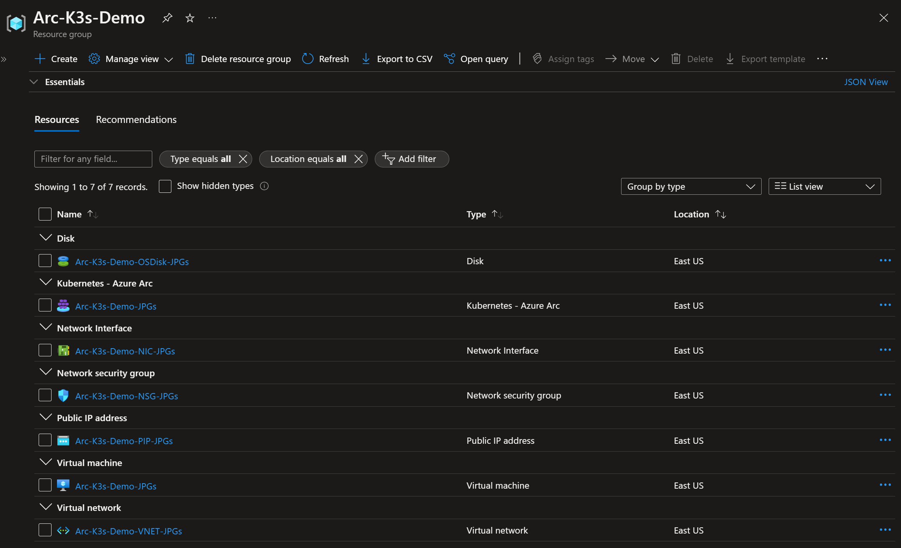

## Deploy Rancher k3s on an Azure VM and connect it to Azure Arc using Terraform

The following Jumpstart scenario will guide you on how to use the provided [Terraform](https://www.terraform.io/) plan to deploy a "Ready to Go" Azure virtual machine installed with single-master Rancher K3s Kubernetes cluster and connected it as an Azure Arc cluster resource.

## Prerequisites

- Clone the Azure Arc Jumpstart repository

    ```shell
    git clone https://github.com/microsoft/azure_arc.git
    ```

- [Install or update Azure CLI to version 2.36.0 and above](https://docs.microsoft.com/cli/azure/install-azure-cli?view=azure-cli-latest). Use the below command to check your current installed version.

  ```shell
  az --version
  ```

- [Install Terraform >=1.1.9](https://learn.hashicorp.com/terraform/getting-started/install.html)

- Create Azure service principal (SP)

    To be able to complete the scenario and its related automation, Azure service principal assigned with the “Contributor” role is required. To create it, login to your Azure account run the below command (this can also be done in [Azure Cloud Shell](https://shell.azure.com/)).

    ```shell
    az login
    subscriptionId=$(az account show --query id --output tsv)
    az ad sp create-for-rbac -n "<Unique SP Name>" --role "Contributor" --scopes /subscriptions/$subscriptionId
    ```

    For example:

    ```shell
    az login
    subscriptionId=$(az account show --query id --output tsv)
    az ad sp create-for-rbac -n "JumpstartArcK8s" --role "Contributor" --scopes /subscriptions/$subscriptionId
    ```

    Output should look like this:

    ```json
    {
    "appId": "XXXXXXXXXXXXXXXXXXXXXXXXXXXX",
    "displayName": "JumpstartArcK8s",
    "password": "XXXXXXXXXXXXXXXXXXXXXXXXXXXX",
    "tenant": "XXXXXXXXXXXXXXXXXXXXXXXXXXXX"
    }
    ```

    > **NOTE: If you create multiple subsequent role assignments on the same service principal, your client secret (password) will be destroyed and recreated each time. Therefore, make sure you grab the correct password**.

    > **NOTE: The Jumpstart scenarios are designed with as much ease of use in-mind and adhering to security-related best practices whenever possible. It is optional but highly recommended to scope the service principal to a specific [Azure subscription and resource group](https://docs.microsoft.com/cli/azure/ad/sp?view=azure-cli-latest) as well considering using a [less privileged service principal account](https://docs.microsoft.com/azure/role-based-access-control/best-practices)**

- [Enable subscription with](https://docs.microsoft.com/azure/azure-resource-manager/management/resource-providers-and-types#register-resource-provider) the two resource providers for Azure Arc-enabled Kubernetes. Registration is an asynchronous process, and registration may take approximately 10 minutes.

  ```shell
  az provider register --namespace Microsoft.Kubernetes
  az provider register --namespace Microsoft.KubernetesConfiguration
  az provider register --namespace Microsoft.ExtendedLocation
  ```

  You can monitor the registration process with the following commands:

  ```shell
  az provider show -n Microsoft.Kubernetes -o table
  az provider show -n Microsoft.KubernetesConfiguration -o table
  az provider show -n Microsoft.ExtendedLocation -o table
  ```

## Automation Flow

For you to get familiar with the automation and deployment flow, below is an explanation.

1. User edits the tfvars script to match the environment.
2. User runs ```terraform init``` to download the required terraform providers.
3. User access the bootstrap VM created by the terraform plan and connects the K3s cluster to Azure Arc using the SPN credentials.
4. User verifies the Arc-enabled Kubernetes cluster.

## Deployment

The only thing you need to do before executing the Terraform plan is to create the tfvars file which will be used by the plan. This is based on the Azure service principal you've just created and your subscription.

- Navigate to the [terraform folder](https://github.com/microsoft/azure_arc/tree/main/azure_arc_k8s_jumpstart/rancher_k3s/terraform) and fill in the terraform.tfvars file with the values for your environment.

    

    For example:
    

- Run the ```terraform init``` command which will download the Terraform AzureRM provider.

    

- Run the ```terraform apply --auto-approve``` command and wait for the plan to finish.

    

Upon completion, you will have new VM installed as a single-host k3s cluster which is already projected as an Azure Arc-enabled Kubernetes cluster in a new resource group.


## Logging

For ease of troubleshooting and tracking, a deployment log will be created automatically as part of the script runtime. To view the deployment log use the below command:

```shell
cat /home/<USER>/jumpstart_logs/installK3s.log
```


> **NOTE: For enhanced security posture, SSH (22) port are not open by default in this scenario. You will need to create a network security group (NSG) rule to allow network access to port 22, or use [Azure Bastion](https://docs.microsoft.com/azure/bastion/bastion-overview) or [Just-in-Time (JIT)](https://docs.microsoft.com/azure/defender-for-cloud/just-in-time-access-usage?tabs=jit-config-asc%2Cjit-request-asc) access to connect to the VM.**

## Cleanup

To delete environment, simply just delete the Azure resource group.


