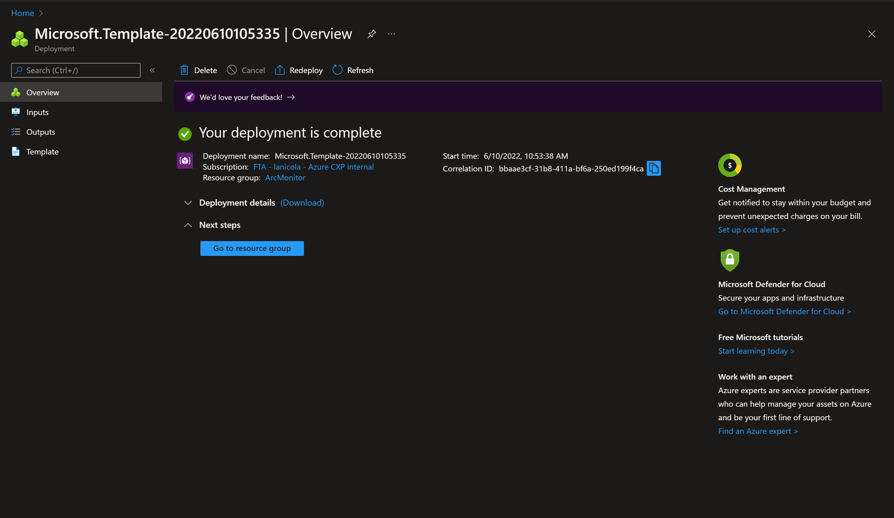
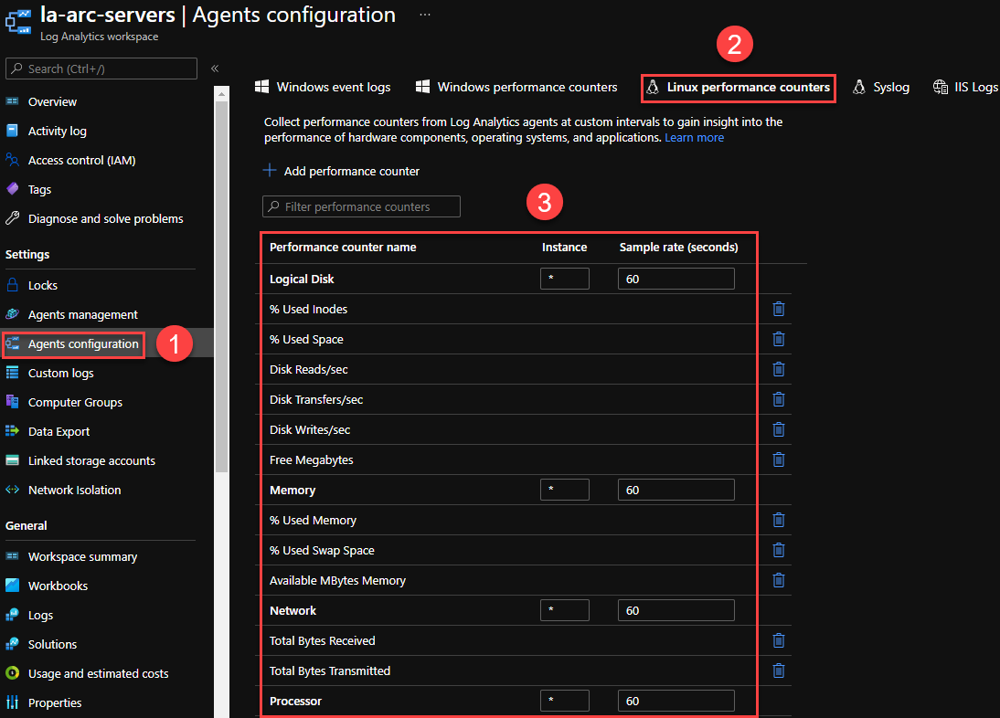
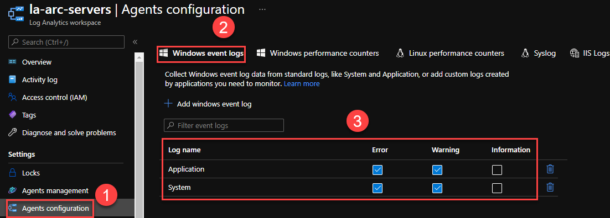
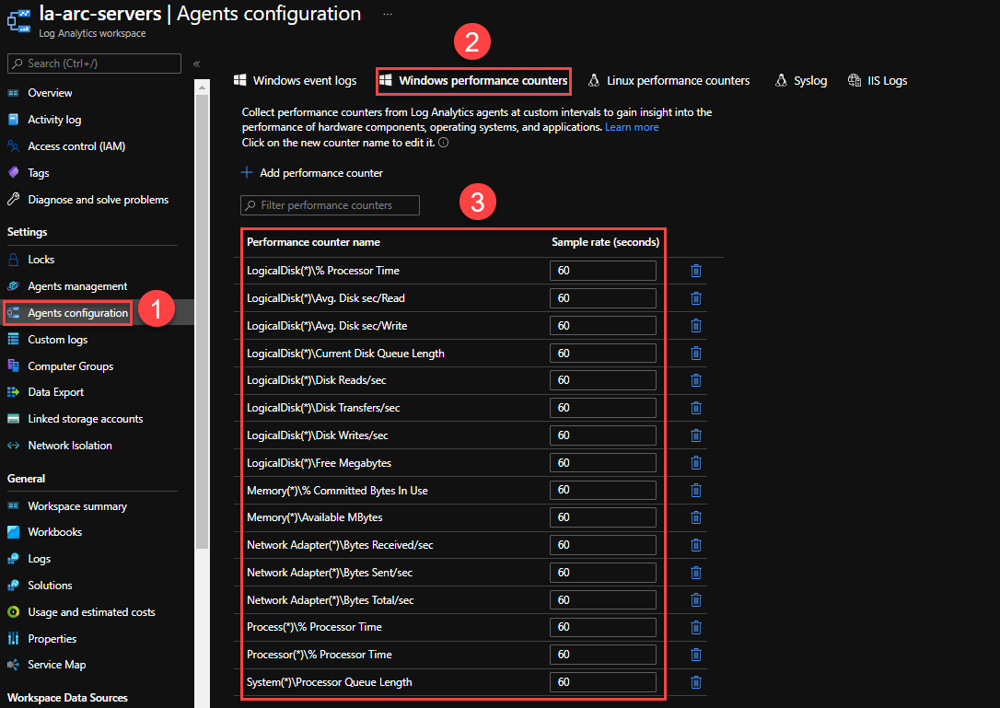
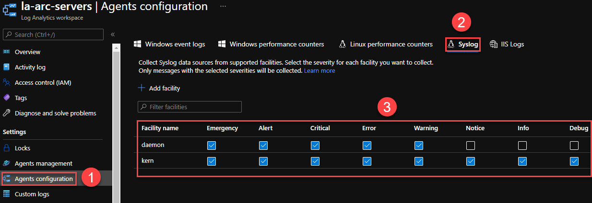

## Enable Azure Monitor on Azure Arc-enabled servers

The scenario will show you how to onboard Azure Arc-enabled servers to [Azure Monitor](https://docs.microsoft.com/en-us/azure/azure-monitor/overview), so you can monitor your Linux and Windows servers running on-premises or at other cloud providers.


In this guide, you will create the following Azure resources that support this Azure Monitor scenario:

* Log Analytics workspace.

* Log data sources: performance counters and events for Windows & Linux.

* VM Insights solution.

* Azure Monitor OS sample alerts.

* Azure Workbooks: AlertsConsole, OSPerformanceAndCapacity and WindowsEvents.

* Azure Dashboard: monitoring overview for Azure Arc-enabled servers.

* Azure Policies to automate agents deployment:
    
    * Configure Log Analytics extension on Azure Arc enabled Windows servers.

    * Configure Log Analytics extension on Azure Arc enabled Linux servers.

    * Configure Dependency agent on Azure Arc enabled Windows servers.

    * Configure Dependency agent on Azure Arc enabled Linux server.

> **Note: This guide assumes you already deployed VMs or servers that are running on-premises or other clouds and you have connected them to Azure Arc. If you haven't, this repository offers you a way to do so in an automated fashion:**

* **[GCP Ubuntu instance](https://azurearcjumpstart.io/azure_arc_jumpstart/azure_arc_servers/gcp/gcp_terraform_ubuntu/)**
* **[GCP Windows instance](https://azurearcjumpstart.io/azure_arc_jumpstart/azure_arc_servers/gcp/gcp_terraform_windows/)**
* **[AWS Ubuntu EC2 instance](https://azurearcjumpstart.io/azure_arc_jumpstart/azure_arc_servers/aws/aws_terraform_ubuntu/)**
* **[AWS Amazon Linux 2 EC2 instance](https://azurearcjumpstart.io/azure_arc_jumpstart/azure_arc_servers/aws/aws_terraform_al2/)**
* **[Azure Ubuntu VM](https://azurearcjumpstart.io/azure_arc_jumpstart/azure_arc_servers/azure/azure_arm_template_linux/)**
* **[Azure Windows VM](https://azurearcjumpstart.io/azure_arc_jumpstart/azure_arc_servers/azure/azure_arm_template_win/)**
* **[VMware vSphere Ubuntu VM](https://azurearcjumpstart.io/azure_arc_jumpstart/azure_arc_servers/vmware/vmware_terraform_ubuntu/)**
* **[VMware vSphere Windows Server VM](https://azurearcjumpstart.io/azure_arc_jumpstart/azure_arc_servers/vmware/vmware_terraform_winsrv/)**
* **[Vagrant Ubuntu box](https://azurearcjumpstart.io/azure_arc_jumpstart/azure_arc_servers/vagrant/local_vagrant_ubuntu/)**
* **[Vagrant Windows box](https://azurearcjumpstart.io/azure_arc_jumpstart/azure_arc_servers/vagrant/local_vagrant_windows/)**

## Prerequisites

* Clone the Azure Arc Jumpstart repository

    ```shell
    git clone https://github.com/microsoft/azure_arc.git
    ```

* As mentioned, this guide starts at the point where you already deployed and connected VMs or bare-metal servers to Azure Arc. For this scenario, as can be seen in the screenshots below, we will be using an Amazon Web Services (AWS) EC2 instance that has been already connected to Azure Arc and is visible as a resource in Azure.

    

    
    
    > **Note: Ensure that the server you will use for this scenario is running an [OS supported by the Log Analytics Agent and the Dependency Agent](https://docs.microsoft.com/en-us/azure/azure-monitor/agents/agents-overview#supported-operating-systems) and meets the [firewall requirements](https://docs.microsoft.com/en-us/azure/azure-monitor/agents/log-analytics-agent#firewall-requirements).**

* [Install or update Azure CLI](https://docs.microsoft.com/en-us/cli/azure/install-azure-cli?view=azure-cli-latest). Azure CLI should be running version 2.14 or later. Use ```az --version``` to check your current installed version.

## Onboarding Azure Monitor

* First, create a new resource group where all the resources mentioned above will be deployed. Please, run the below command, replacing the values in brackets with your own.

    ```shell
    az group create --name <Name for your resource group> \
    --location <Location for your resources> \
    --tags "Project=jumpstart_azure_arc_servers"
    ```

    

* Next, edit the ARM template [parameters file](https://github.com/microsoft/azure_arc/blob/main/azure_arc_servers_jumpstart/monitoring/monitoring-template.json), providing a name for your Log Analytics workspace and a single email account, which will be used for Azure Monitor alerts notifications. Please, see the [example](https://github.com/microsoft/azure_arc/blob/main/azure_arc_servers_jumpstart/monitoring/monitoring-template.example.parameters.json) below:

    

* To deploy the ARM template, navigate to the [deployment folder](https://github.com/microsoft/azure_arc/tree/main/azure_arc_servers_jumpstart/monitoring) and run the below command:

    ```shell
    az deployment group create --resource-group <Name of the Azure resource group you created> \
        --template-file monitoring-template.json \
        --parameters monitoring-template.parameters.json
    ```

   

* When the deployment is complete, you should be able to see the resource group with your Log Analytics workspace, azure dashboard, vminsights solution and three workbooks: 

    

* Please, note that most of the deployed resources are hidden:

    

## Confirm that the Azure Monitor resources are deployed

* Click on the **Policies** blade of the **resource group** where you deployed this scenario, and verify that the following **policies** are assigned: 

    

* Click on the **Agents Configuration** blade of the **Log Analytics workspace** and verify that the following **data sources** are enabled:

    

    

    

    

* Click on the **Solutions** blade of the **Log Analytics workspace** and verify that  **VM Insights** is enabled:

    

* Go to **Monitor**, **Alerts** and click on **Action Groups**: 

    

* Filter by **Subscription** and **Resource Group**, and verify the following **action group** is created: 

    

* Click on the **action group name**, then on the **edit** button, and verify the **email account** is the one you provided in the **parameters file**: 

    

    

* Go to **Monitor**, **Alerts** and click on **Alert rules**: 

    

* Filter by **Subscription** and **Resource Group**, and verify the following **alerts** are enabled: 

    

    > **Note: This is just a small example of Azure Monitor alerts, based on log queries and log analytics workspace metrics. You may need to adjust alerts thresholds to your environment expected behaviour.**

## Deploying the Log Analytics Agent and the Dependency Agent
This scenario is mainly based on the data collected from the Azure Arc-enabled servers into the Log Analytics workspace. Therefore, it is required to deploy on these servers the [Log Analytics Agent](https://docs.microsoft.com/en-us/azure/azure-monitor/agents/agents-overview#log-analytics-agent) and the [Dependency Agent](https://docs.microsoft.com/en-us/azure/azure-monitor/agents/agents-overview#dependency-agent). There are multiple [methods](https://docs.microsoft.com/en-us/azure/azure-monitor/agents/log-analytics-agent#installation-options) to deploy these agents. In this scenario, Azure Policies are used to deploy both agents in Windows and Linux. 

For **new** Azure Arc-enabled servers connected within the scope of the policies assignments, the policies will deploy the agents automatically.

For **existing** Azure Arc-enabled servers connected within the scope of the policies assignments, you will need to manually create a remediation task for each policy.

## Azure Dashboard, Workbooks and VMInsights
* It may take several hours for Update Management to collect enough data to show an assessment for your VM. In the screen below we can see the assessment is being performed. --> PARA VM INSIGHTS ME VALE

## Clean up environment

Complete the following steps to clean up your environment.

* Remove the virtual machines from each environment by following the teardown instructions from each guide.

* **[GCP Ubuntu instance](https://azurearcjumpstart.io/azure_arc_jumpstart/azure_arc_servers/gcp/gcp_terraform_ubuntu/)**
* **[GCP Windows instance](https://azurearcjumpstart.io/azure_arc_jumpstart/azure_arc_servers/gcp/gcp_terraform_windows/)**
* **[AWS Ubuntu EC2 instance](https://azurearcjumpstart.io/azure_arc_jumpstart/azure_arc_servers/aws/aws_terraform_ubuntu/)**
* **[AWS Amazon Linux 2 EC2 instance](https://azurearcjumpstart.io/azure_arc_jumpstart/azure_arc_servers/aws/aws_terraform_al2/)**
* **[Azure Ubuntu VM](https://azurearcjumpstart.io/azure_arc_jumpstart/azure_arc_servers/azure/azure_arm_template_linux/)**
* **[Azure Windows VM](https://azurearcjumpstart.io/azure_arc_jumpstart/azure_arc_servers/azure/azure_arm_template_win/)**
* **[VMware vSphere Ubuntu VM](https://azurearcjumpstart.io/azure_arc_jumpstart/azure_arc_servers/vmware/vmware_terraform_ubuntu/)**
* **[VMware vSphere Windows Server VM](https://azurearcjumpstart.io/azure_arc_jumpstart/azure_arc_servers/vmware/vmware_terraform_winsrv/)**
* **[Vagrant Ubuntu box](https://azurearcjumpstart.io/azure_arc_jumpstart/azure_arc_servers/vagrant/local_vagrant_ubuntu/)**
* **[Vagrant Windows box](https://azurearcjumpstart.io/azure_arc_jumpstart/azure_arc_servers/vagrant/local_vagrant_windows/)**

* Delete the resource group.

    ```shell
    az group delete --name <Name of your resource group>
    ```

    
