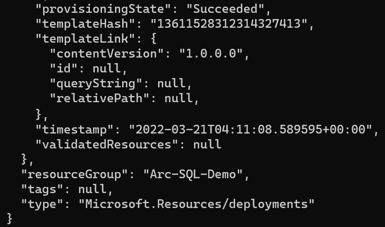
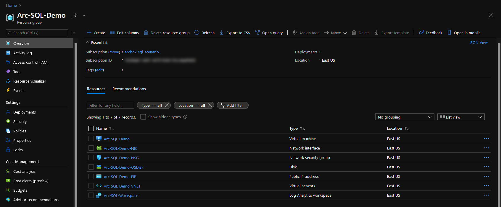
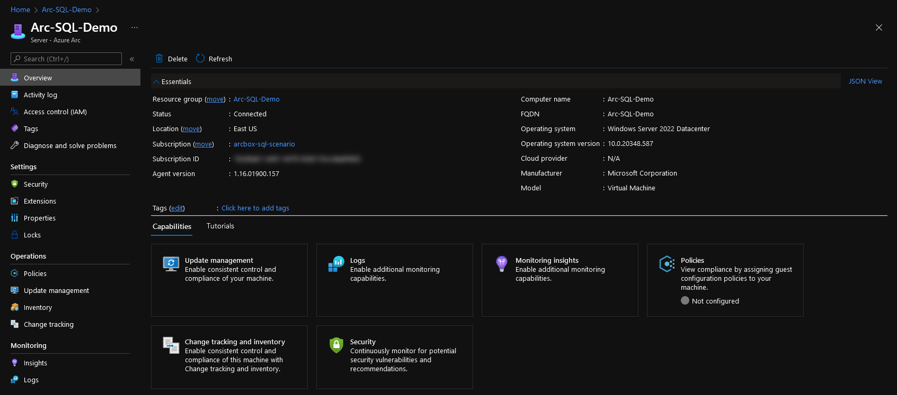
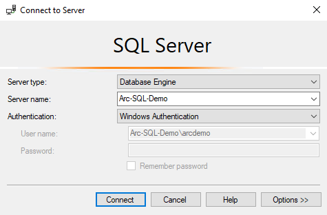

## Deploy an Azure Virtual Machine with Windows Server & Microsoft SQL Server and connect it to Azure Arc using Terraform

The following README will guide you on how to use the provided [Azure ARM Template](https://docs.microsoft.com/en-us/azure/azure-resource-manager/templates/overview) to deploy an Azure VM installed with Windows Server and Microsoft SQL Server 2019 (Developer edition) and connect it as an Azure Arc-enabled SQL server resource.

Azure VMs are leveraging the [Azure Instance Metadata Service (IMDS)](https://docs.microsoft.com/en-us/azure/virtual-machines/windows/instance-metadata-service) by default. By projecting an Azure VM as an Azure Arc-enabled server, a "conflict" is created which will not allow for the Azure Arc server resources to be represented as one when the IMDS is being used and instead, the Azure Arc server will still "act" as a native Azure VM.

However, **for demo purposes only**, the below guide will allow you to use and onboard Azure VMs to Azure Arc and by doing so, you will be able to simulate a server which is deployed outside of Azure (i.e "on-premises" or in other cloud platforms)

> **Note: It is not expected for an Azure VM to be projected as an Azure Arc-enabled server. The below scenario is unsupported and should ONLY be used for demo and testing purposes.**

By the end of the guide, you will have an Azure VM installed with Windows Server 2019 with SQL Server 2019, projected as an Azure Arc-enabled SQL Server and a running SQL assessment with data injected to Azure Log Analytics workspace.

## Prerequisites

* Clone the Azure Arc Jumpstart repository

    ```shell
    git clone https://github.com/microsoft/azure_arc.git
    ```

* [Install or update Azure CLI to version 2.25.0 and above](https://docs.microsoft.com/en-us/cli/azure/install-azure-cli?view=azure-cli-latest). Use the below command to check your current installed version.

    ```shell
    az --version
    ```

* In case you don't already have one, you can [Create a free Azure account](https://azure.microsoft.com/en-us/free/).

* Create Azure service principal (SP)

    To be able to complete the scenario and its related automation, Azure service principal assigned with the “Contributor” role is required. To create it, login to your Azure account run the below command (this can also be done in [Azure Cloud Shell](https://shell.azure.com/)).

    ```shell
    az login
    az account set --subscription "<Subscription ID>"
    az ad sp create-for-rbac -n "<Unique SP Name>" --role contributor
    ```

    For example:

    ```shell
    az account set --subscription "xxxxxxxx-xxxx-xxxx-xxxx-xxxxxxxx"
    az ad sp create-for-rbac -n "http://AzureArcServers" --role contributor
    ```

    Output should look like this:

    ```json
    {
    "appId": "XXXXXXXXXXXXXXXXXXXXXXXXXXXX",
    "displayName": "AzureArcServers",
    "name": "http://AzureArcServers",
    "password": "XXXXXXXXXXXXXXXXXXXXXXXXXXXX",
    "tenant": "XXXXXXXXXXXXXXXXXXXXXXXXXXXX"
    }
    ```

    > **Note It is optional, but highly recommended, to scope the SP to a specific [Azure subscription and resource group](https://docs.microsoft.com/en-us/cli/azure/ad/sp?view=azure-cli-latest).**

* Enable subscription for the *Microsoft.AzureArcData* resource provider for Azure Arc-enabled SQL Server. Registration is an asynchronous process, and registration may take approximately 10 minutes.

  ```shell
  az provider register --namespace Microsoft.AzureArcData
  ```

  You can monitor the registration process with the following commands:

  ```shell
  az provider show -n Microsoft.AzureArcData -o table
  ```

## Automation Flow

The automation for this scenario includes 3 PowerShell scripts executed in the following order:

1. [*Bootstrap.ps1*](https://github.com/microsoft/azure_arc/blob/main/azure_arc_sqlsrv_jumpstart/azure/arm_template/scripts/Bootstrap.ps1) - Executed at ARM Template deployment time as a CustomScriptExtension. This script has the following functionalities:

    1. Download and install pre-requisite utilities via [Chocolatey](https://chocolatey.org/).
    2. Download the [*LogonScript.ps1*](https://github.com/microsoft/azure_arc/blob/main/azure_arc_sqlsrv_jumpstart/azure/arm_template/scripts/LogonScript.ps1) and [*installArcAgentSQL.ps1*](https://github.com/microsoft/azure_arc/blob/main/azure_arc_sqlsrv_jumpstart/azure/arm_template/scripts/installArcAgentSQL.ps1) scripts.  

2. [*LogonScript.ps1*](https://github.com/microsoft/azure_arc/blob/main/azure_arc_sqlsrv_jumpstart/azure/arm_template/scripts/LogonScript.ps1) - Executed upon initial login to the SQL virtual machine. This script has the following functionalities:

    1. Install and configure SQL Server on the VM
    2. Restore AdventureWorksLT2019 Database
    3. Allow Azure VM to be onboard to Azure Arc
    4. Execute the *installArcAgentSQL* script

3. [*installArcAgentSQL.ps1*](https://github.com/microsoft/azure_arc/blob/main/azure_arc_sqlsrv_jumpstart/azure/arm_template/scripts/installArcAgentSQL.ps1) - This is the main script and will be executed by the *LogonScript* script at VM runtime. This script has the following functionalities:

    1. Project SQL Server as an Azure Arc-enabled SQL server resource
    2. Install Log Analytics agent using extension on Azure Arc server
    3. Create SQL Assessment and inject data to Azure Log Analytics workspace

For you to get familiar with the automation and deployment flow, below is an explanation.

1. User is editing the ARM template parameters file (1-time edit). These parameters values are being used throughout the deployment.

2. The ARM template incl. an Azure VM Custom Script Extension which will deploy the the [*Bootstrap.ps1*](https://github.com/microsoft/azure_arc/blob/main/azure_arc_sqlsrv_jumpstart/azure/arm_template/scripts/Bootstrap.ps1) PowerShell Script. The script will:

    1. Download the *LogonScript.ps1* and *installArcAgentSQL* PowerShell scripts

    2. Set local OS environment variables

## Deployment

As mentioned, this deployment will use an ARM Template. You will deploy a single template, responsible for creating all the Azure resources in a single resource group as well onboarding the created VM to Azure Arc.

* Before deploying the ARM template, login to Azure using AZ CLI with the ```az login``` command.

* The deployment is using the ARM template parameters file. Before initiating the deployment, edit the [*azuredeploy.parameters.json*](https://github.com/microsoft/azure_arc/blob/main/azure_arc_sqlsrv_jumpstart/azure/arm_template/azuredeploy.parameters.json) file located in your local cloned repository folder. An example parameters file is located [here](https://github.com/microsoft/azure_arc/blob/main/azure_arc_sqlsrv_jumpstart/azure/arm_template/azuredeploy.parameters.example.json).

* Create a Resource Group which will house the target for the ARM Template deployment using the following command:

    ```shell
    az group create --name <Name of the Azure resource group> --location <Azure Region> --tags "Project=jumpstart_azure_arc_sql"
    ```

    For example:

    ```shell
    az group create --name Arc-SQL-Demo --location "East US" --tags "Project=jumpstart_azure_arc_sql"
    ```

* To deploy the ARM template, navigate to the local cloned [deployment folder](https://github.com/microsoft/azure_arc/tree/main/azure_arc_sqlsrv_jumpstart/azure/arm_template) and run the below command:

    ```shell
    az deployment group create \
    --resource-group <Name of the Azure resource group> \
    --name <The name of this deployment> \
    --template-uri https://raw.githubusercontent.com/microsoft/azure_arc/main/azure_arc_sqlsrv_jumpstart/azure/arm_template/azuredeploy.json \
    --parameters <The *azuredeploy.parameters.json* parameters file location>
    ```

    > **Note: Make sure that you are using the same Azure resource group name as the one you created in the previous step**

    For example:

    ```shell
    az deployment group create \
    --resource-group Arc-SQL-Demo \
    --name arcsqlsrvdemo \
    --template-uri https://raw.githubusercontent.com/microsoft/azure_arc/main/azure_arc_sqlsrv_jumpstart/azure/arm_template/azuredeploy.json \
    --parameters azuredeploy.parameters.json
    ```

* Once Azure resources has been provisioned, you will be able to see it in Azure portal.

    

    

## Windows Login & Post Deployment

* Now that the Windows Server VM has been deployed, it is time to login to it. Using it's public IP, RDP to the VM.

    

* At first login, as mentioned in the "Automation Flow" section, a logon script will get executed. This script was created as part of the automated deployment process.

    Let the script to run its course and **do not close** the PowerShell session, this will be done for you once completed.

    > **Note: The script run time is ~30min long**

    

* Upon successful run, in the Azure portal, notice you now have a new Azure Arc-enabled server (with the Microsoft Monitoring agent installed via an extension) and Azure Arc-enabled SQL resources as well as Azure Log Analytics added to the resource group.

    

    

    

* Open Microsoft SQL Server Management Studio (a Windows shortcut will be created for you) and validate the *AdventureWorksLT2019* sample database is deployed as well.

    

    

## Azure SQL Assessment

Now that you have both the server and SQL projected as Azure Arc resources, the last step is complete the initiation of the SQL Assessment run.

* On the SQL Azure Arc resource, click on "Environment Health" followed by clicking the "Download configuration script".

    Since the *LogonScript* run in the deployment step took care of deploying and installing the required binaries, you can safely ignore and delete the downloaded *AddSqlAssessment.ps1* file.

    Clicking the "Download configuration script" will simply send a REST API call to the Azure portal which will make "Step3" available and will result with a grayed-out "View SQL Assessment Results" button.

    

    

    

    

    It might take a bit of time, but after ~45-60min you will notice how the "View SQL Assessment Results" button is available for you to click on. At this point, the SQL assessment data and logs are getting injected to Azure Log Analytics.

    Initially, the amount of data will be limited as it take a while for the assessment to complete a full cycle but after few hours you should be able to see much more data coming in.  

    

    

## Cleanup

To delete the entire deployment, simply delete the resource group from the Azure portal.


