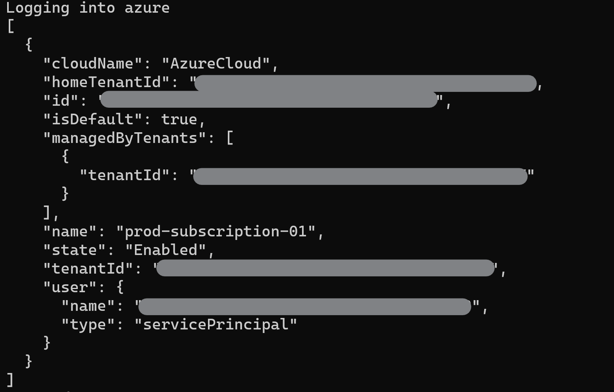
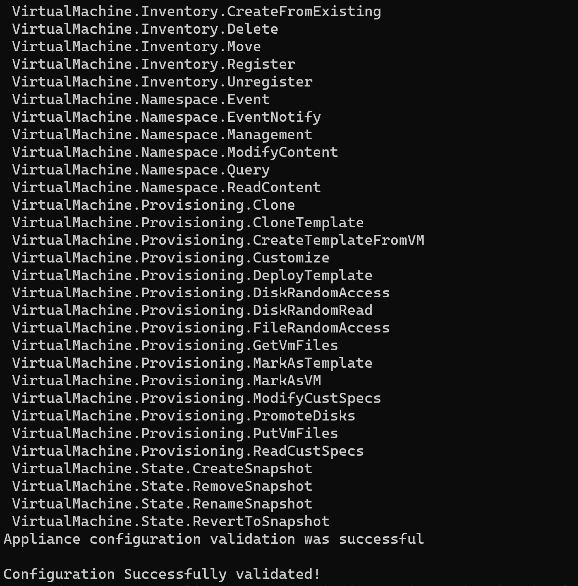
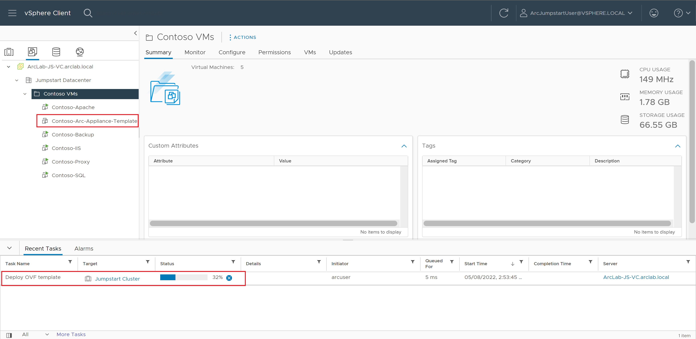
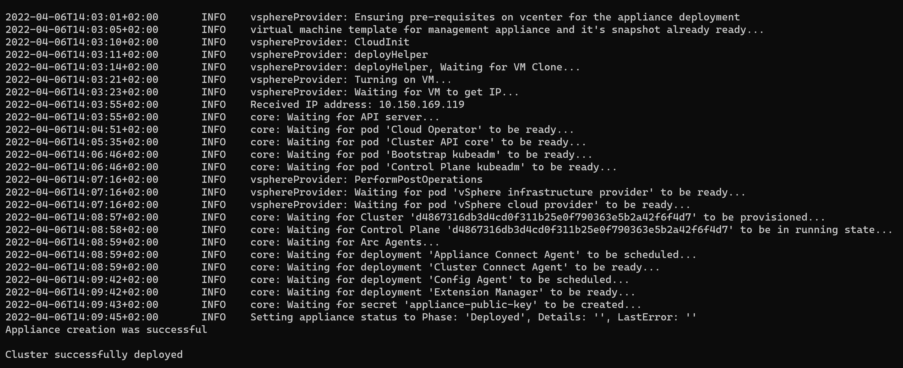

## Connect VMware vCenter Server to Azure Arc using PowerShell

The following README will guide you on how to use the provided PowerShell script to deploy the [Azure Arc resource bridge](https://docs.microsoft.com/en-us/azure/azure-arc/resource-bridge/overview) in your vSphere environment to connect your vCenter Server to Azure Arc.

> **NOTE:  This guide will not provide instructions on how to deploy and set up your VMware environment, it must be already provisioned.**

## Prerequisites

- Clone the Azure Arc Jumpstart repository

    ```shell
    git clone https://github.com/microsoft/azure_arc.git
    ```

- Create Azure service principal (SP)

    To be able to complete the scenario and its related automation, an Azure service principal assigned with the “Contributor” role is required. To create it, login to your Azure account using PowerShell and run the below command.

    ```powershell
    Connect-AzAccount
    $sp = New-AzADServicePrincipal -DisplayName "<Unique SP Name>" -Role 'Contributor'
    ```

    For example:

    ```powershell
    $sp = New-AzADServicePrincipal -DisplayName "AzureArcvSphere" -Role 'Contributor'
    ```

    This command will create a variable with a secure string as shown below:

    ```shell
    Secret                : System.Security.SecureString
    ServicePrincipalNames : {XXXXXXXXXXXXXXXXXXXXXXXXXXXX, http://AzureArcvSphere}
    ApplicationId         : XXXXXXXXXXXXXXXXXXXXXXXXXXXX
    ObjectType            : ServicePrincipal
    DisplayName           : AzureArcvSphere
    Id                    : XXXXXXXXXXXXXXXXXXXXXXXXXXXX
    Type                  :
    ```

    To expose the generated password use the below code to export the secret:

    ```powershell
    $BSTR = [System.Runtime.InteropServices.Marshal]::SecureStringToBSTR($sp.Secret)
    $UnsecureSecret = [System.Runtime.InteropServices.Marshal]::PtrToStringAuto($BSTR)
    ```

    Copy and save the Service Principal ApplicationId and Secret as you will need it for later on in the automation.

    > **NOTE: It is optional but highly recommended to scope the SP to a specific [Azure subscription and resource group](https://docs.microsoft.com/en-us/powershell/module/az.resources/new-azadserviceprincipal?view=azps-5.4.0)**

- As mentioned, this guide starts at the point where you already have an up and running VMware environment managed by vCenter. The automation will be run from a PowerShell window on a computer (can be your local computer) that has network connectivity to vCenter.

    > **NOTE: the script will automatically uninstall any pre-existing Azure CLI versions in the workstation and will deploy the latest 64 bit version, as it is a requirement to deploy the Resource Bridge**

## Automation Flow

For you to get familiar with the automation and deployment flow, below is an explanation.

- User is editing the onboarding PowerShell script to match the environment (1-time edit).

- User will run the script from the local workstation.

- User will verify the correct onboarding.

## Connect VMware vCenter Server to Azure Arc

- Change the environment variables according to your environment:
  - location: the Azure Region you want to deploy to
  - SubscriptionId: your subscription ID
  - ResourceGroupName: name of the Azure Resource Group you will create your resources in
  - applianceName: a name for the Bridge appliance
  - customLocationName: a name for the Azure Arc custom location
  - vCenterName: your vCenter name
  - vcenterfqdn: your vCenter fully qualified name
  - vcenterusername: username to authenticate to vCenter
  - vcenterpassword: password to authenticate to vCenter
  - appID: your service principal App ID
  - password: your service principal password
  - tenantId: your Azure AD tenant ID

  

- Once you have provided all of the required environment variables. Open an administrative PowerShell window and run the script with the command:

  ```powershell
  .\vCenter_onboarding.ps1
  ```

  

  

  

  

- While the script is running, from vCenter you should be able to see a running task:

  

- Once the script has finished its run, you should see a message as the one shown below:

  

  

- Tasks in vCenter should show a "Completed" status and a new VM should be part of your inventory

  

  

- From the Azure Portal, in the resource group you should see three new resources, including a VMware vCenter:

  

  

- You should also be able to get a list of VMs that are managed by the vCenter:

  

## Clean up environment

Complete the following steps to clean up your environment.
