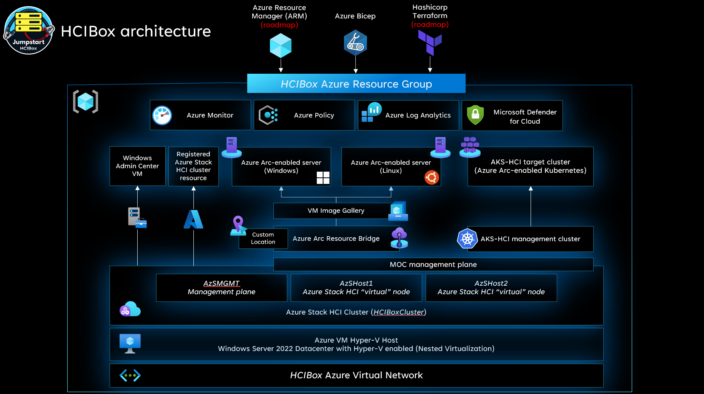
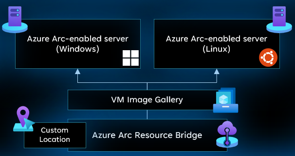
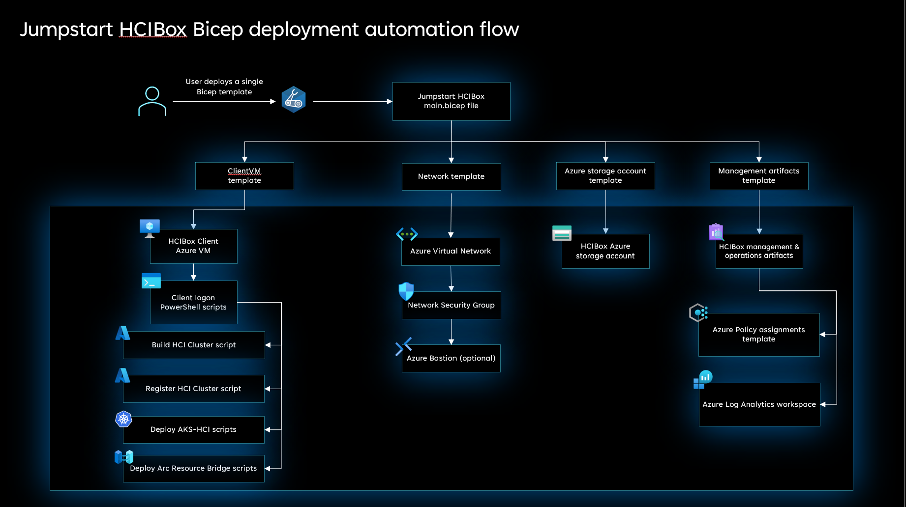
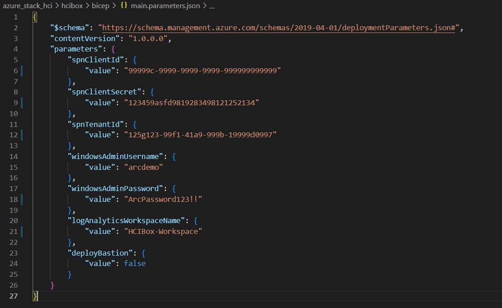
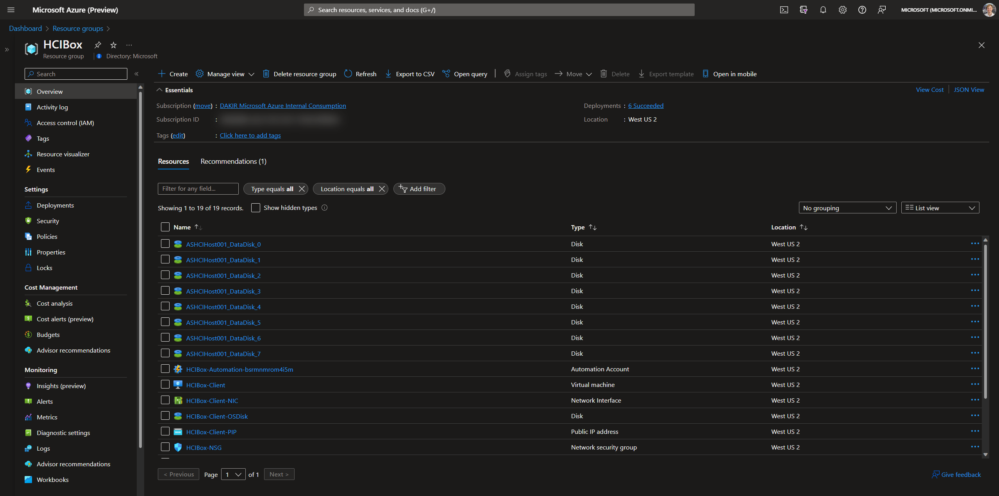
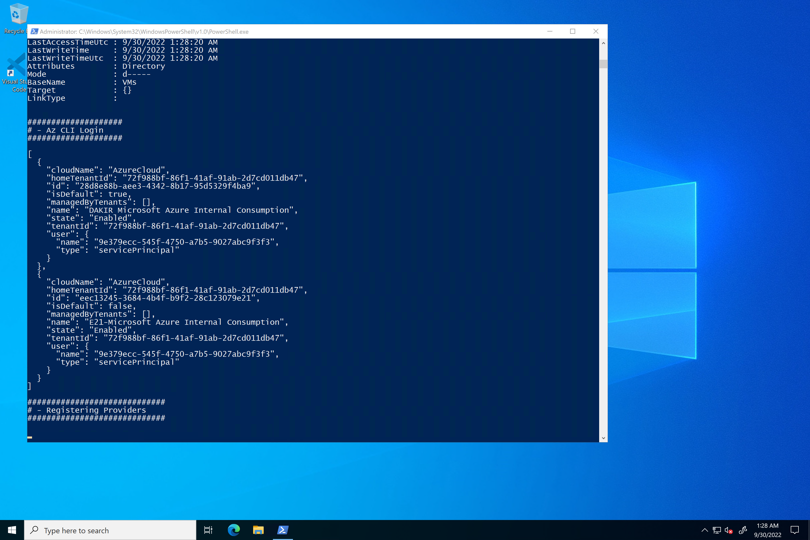
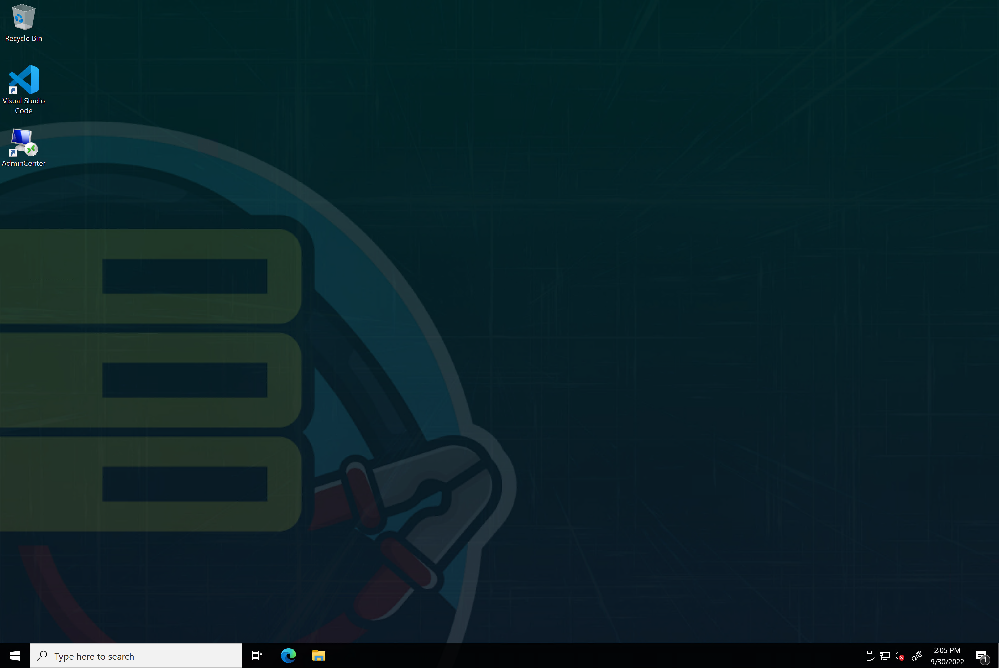
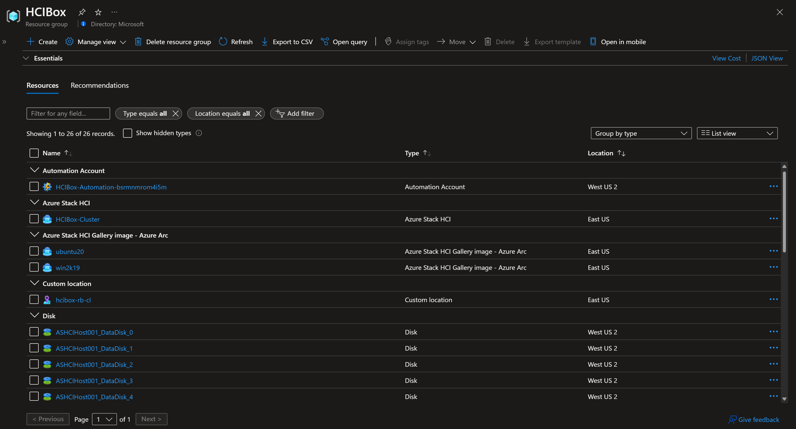

## Jumpstart HCIBox - Overview

HCIBox is a turnkey solution that provides a complete sandbox for exploring [Azure Stack HCI](https://learn.microsoft.com/azure-stack/hci/overview) capabilities and hybrid cloud integration in a virtualized environment. HCIBox is designed to be completely self-contained within a single Azure subscription and resource group, which will make it easy for a user to get hands-on with Azure Stack HCI and [Azure Arc](https://learn.microsoft.com/azure/azure-arc/overview) technology without the need for physical hardware.



### Use cases

- Sandbox environment for getting hands-on with Azure Stack HCI and Azure Arc technologies
- Accelerator for Proof-of-concepts or pilots
- Training tool for skills development
- Demo environment for customer presentations or events
- Rapid integration testing platform
- Infrastructure-as-code and automation template library for building hybrid cloud management solutions

## Azure Stack HCI capabilities available in HCIBox

### 2-node Azure Stack HCI cluster

HCIBox automatically provisions and configures a two-node Azure Stack HCI cluster. HCIBox simulates physical hardware by using nested virtualization with Hyper-V running on an Azure Virtual Machine. This Hyper-V host provisions three guest virtual machines: two Azure Stack HCI nodes (AzSHost1, AzSHost2), and one nested Hyper-V host (AzSMGMT). AzSMGMT itself hosts three guest VMs: a [Windows Admin Center](https://learn.microsoft.com/windows-server/manage/windows-admin-center/overview) gateway server, an [Active Directory domain controller](https://learn.microsoft.com/windows-server/identity/ad-ds/get-started/virtual-dc/active-directory-domain-services-overview), and a [Routing and Remote Access Server](https://learn.microsoft.com/windows-server/remote/remote-access/remote-access) acting as a BGP router.


### Azure Arc Resource Bridge

HCIBox installs and configures [Azure Arc Resource Bridge](https://learn.microsoft.com/azure/azure-arc/resource-bridge/overview). This allows full virtual machine lifecycle management from Azure portal or CLI. As part of this configuration, HCIBox also configures a [custom location](https://learn.microsoft.com/azure-stack/hci/manage/deploy-arc-resource-bridge-using-command-line?tabs=for-static-ip-address#create-a-custom-location-by-installing-azure-arc-resource-bridge) and deploys two [gallery images](https://learn.microsoft.com/azure-stack/hci/manage/deploy-arc-resource-bridge-using-command-line?tabs=for-static-ip-address#create-virtual-network-and-gallery-image) (Windows Server 2019 and Ubuntu). These gallery images can be used to create virtual machines through the Azure portal.



### Azure Kubernetes Service on Azure Stack HCI

HCIBox includes [Azure Kubernetes Services on Azure Stack HCI (AKS-HCI)](https://learn.microsoft.com/azure-stack/aks-hci/). As part of the deployment automation, HCIBox configures AKS-HCI infrastructure including a management cluster. It then creates a [target](https://learn.microsoft.com/azure-stack/aks-hci/kubernetes-concepts), or "workload", cluster (HCIBox-AKS-$randomguid). As an optional capability, HCIBox also includes a PowerShell script that can be used to configure a sample application on the target cluster using [GitOps](https://learn.microsoft.com/azure/azure-arc/kubernetes/tutorial-use-gitops-flux2).


### Hybrid unified operations

HCIBox includes capabilities to support managing, monitoring and governing the cluster. The deployment automation configures [Azure Stack HCI Insights](https://learn.microsoft.com/azure-stack/hci/manage/monitor-hci-multi) along with [Azure Monitor](https://learn.microsoft.com/azure/azure-monitor/overview) and a [Log Analytics workspace](https://learn.microsoft.com/azure/azure-monitor/logs/log-query-overview). Additionally, [Azure Policy](https://learn.microsoft.com/azure/governance/policy/overview) can be configured to support automation configuration and remediation of resources.


## HCIBox Azure Consumption Costs

HCIBox resources generate Azure Consumption charges from the underlying Azure resources including core compute, storage, networking and auxiliary services. Note that Azure consumption costs may vary depending the region where HCIBox is deployed. Be mindful of your HCIBox deployments and ensure that you disable or delete HCIBox resources when not in use to avoid unwanted charges. Please see the [Jumpstart FAQ](https://aka.ms/Jumpstart-FAQ) for more information on consumption costs.

## Deployment Options and Automation Flow

HCIBox currently provides a [Bicep](https://learn.microsoft.com/en-us/azure/azure-resource-manager/bicep/overview?tabs=bicep) template that deploys the infrastructure and automation that configure the solution.



HCIBox uses an advanced automation flow to deploy and configure all necessary resources with minimal user interaction. The previous diagram provides an overview of the deployment flow. A high-level summary of the deployment is:

- User deploys the primary Bicep file (_main.bicep_). This file contains several nested objects that will run simultaneously.
  - Host template - deploys the _HCIBox-Client_ VM. This is the Hyper-V host VM that uses nested virtualization to host the complete HCIBox infrastructure. Once the Bicep template finishes deploying, the user remotes into this client using RDP to start the second step of the deployment.
  - Network template - deploys the network artifacts required for the solution
  - Storage account template - used for staging files in automation scripts and as the cloud witness for the HCI cluster
  - Management artifacts template - deploys Azure Log Analytics workspace and solutions and Azure Policy artifacts
- User remotes into _HCIBox-Client_ VM, which automatically kicks off a PowerShell script that:
  - Deploys and configure three (3) nested virtual machines in Hyper-V
    - Two (2) Azure Stack HCI virtual nodes
    - One (1) Windows Server 2019 virtual machine
  - Configures the necessary virtualization and networking infrastructure on the Hyper-V host to support the HCI cluster.
  - Deploys an Active Directory domain controller, a Windows Admin Center server in gateway mode, and a Remote Access Server acting as a BGP router
  - Registers the HCI Cluster with Azure
  - Deploys AKS-HCI and a target AKS cluster
  - Deploys Arc Resource Bridge and gallery VM images

## Prerequisites

- [Install or update Azure CLI to version 2.40.0 and above](https://docs.microsoft.com/cli/azure/install-azure-cli?view=azure-cli-latest). Use the below command to check your current installed version.

  ```shell
  az --version
  ```

- Login to AZ CLI using the ```az login``` command.

- Ensure that you have selected the correct subscription you want to deploy HCIBox to by using the ```az account list --query "[?isDefault]"``` command. If you need to adjust the active subscription used by Az CLI, follow [this guidance](https://docs.microsoft.com/cli/azure/manage-azure-subscriptions-azure-cli#change-the-active-subscription).

- HCIBox must be deployed to one of the following regions. **Deploying HCIBox outside of these regions may result in unexpected results or deployment errors.**

  - East US
  - East US 2
  - West US 2
  - North Europe

  > **NOTE: Some HCIBox resources will be created in regions other than the one you initially specify. This is due to limited regional availability of the various services included in HCIBox.**

- **HCIBox requires 48 DSv5-series vCPUs** when deploying with default parameters such as VM series/size. Ensure you have sufficient vCPU quota available in your Azure subscription and the region where you plan to deploy HCIBox. You can use the below Az CLI command to check your vCPU utilization.

  ```shell
  az vm list-usage --location <your location> --output table
  ```

  

- Register necessary Azure resource providers by running the following commands.

  ```shell
  az provider register --namespace Microsoft.HybridCompute --wait
  az provider register --namespace Microsoft.GuestConfiguration --wait
  az provider register --namespace Microsoft.Kubernetes --wait
  az provider register --namespace Microsoft.KubernetesConfiguration --wait
  az provider register --namespace Microsoft.ExtendedLocation --wait
  az provider register --namespace Microsoft.AzureArcData --wait
  az provider register --namespace Microsoft.OperationsManagement --wait
  az provider register --namespace Microsoft.AzureStackHCI --wait
  az provider register --namespace Microsoft.ResourceConnector --wait
  ```

- Create Azure service principal (SP). To deploy HCIBox, an Azure service principal assigned with the "Owner" role-based access control (RBAC) role is required:

    To create it login to your Azure account run the below command (this can also be done in [Azure Cloud Shell](https://shell.azure.com/).

    ```shell
    az login
    subscriptionId=$(az account show --query id --output tsv)
    az ad sp create-for-rbac -n "<Unique SP Name>" --role "Owner" --scopes /subscriptions/$subscriptionId
    ```

    For example:

    ```shell
    az login
    subscriptionId=$(az account show --query id --output tsv)
    az ad sp create-for-rbac -n "JumpstartHCIBox" --role "Owner" --scopes /subscriptions/$subscriptionId
    ```

    Output should look similar to this:

    ```json
    {
    "appId": "XXXXXXXXXXXXXXXXXXXXXXXXXXXX",
    "displayName": "JumpstartHCIBox",
    "password": "XXXXXXXXXXXXXXXXXXXXXXXXXXXX",
    "tenant": "XXXXXXXXXXXXXXXXXXXXXXXXXXXX"
    }
    ```

    > **NOTE: If you create multiple subsequent role assignments on the same service principal, your client secret (password) will be destroyed and recreated each time. Therefore, make sure you grab the correct password.**

    > **NOTE: The Jumpstart scenarios are designed with as much ease of use in-mind and adhering to security-related best practices whenever possible. It is optional but highly recommended to scope the service principal to a specific [Azure subscription and resource group](https://docs.microsoft.com/cli/azure/ad/sp?view=azure-cli-latest) as well considering using a [less privileged service principal account](https://docs.microsoft.com/azure/role-based-access-control/best-practices)**

## Bicep deployment via Azure CLI

- Clone the Azure Arc Jumpstart repository

  ```shell
  git clone https://github.com/microsoft/azure_arc.git
  ```

- Upgrade to latest Bicep version

  ```shell
  az bicep upgrade
  ```

- Edit the [main.parameters.json](https://github.com/microsoft/azure_arc/blob/feature_azshci/azure_stack_hci/hcibox/bicep/main.parameters.json) template parameters file and supply some values for your environment.
  - _`spnClientId`_ - Your Azure service principal id
  - _`spnClientSecret`_ - Your Azure service principal secret
  - _`spnTenantId`_ - Your Azure tenant id
  - _`windowsAdminUsername`_ - Client Windows VM Administrator name
  - _`windowsAdminPassword`_ - Client Windows VM Password. Password must have 3 of the following: 1 lower case character, 1 upper case character, 1 number, and 1 special character. The value must be between 12 and 123 characters long.
  - _`logAnalyticsWorkspaceName`_ - Unique name for the HCIBox Log Analytics workspace
  - _`deployBastion`_ - Option to deploy Azure Bastion which used to connect to the _HCIBox-Client_ VM instead of normal RDP

  

- Now you will deploy the Bicep file. Navigate to the local cloned [deployment folder](https://github.com/microsoft/azure_arc/tree/main/azure_stack_hci/hcibox/bicep) and run the below command:

  ```shell
  az group create --name "<resource-group-name>"  --location "<preferred-location>"
  az deployment group create -g "<resource-group-name>" -f "main.bicep" -p "main.parameters.json"
  ```

  

## Start post-deployment automation

Once your deployment is complete, you can open the Azure portal and see the initial HCIBox resources inside your resource group. You will be using both Azure portal the _HCIBox-Client_ Azure virtual machine to interact with the HCIBox resources.

  

   > **NOTE: For enhanced HCIBox security posture, RDP (3389) and SSH (22) ports are not open by default in HCIBox deployments. You will need to create a network security group (NSG) rule to allow network access to port 3389, or use [Azure Bastion](https://docs.microsoft.com/azure/bastion/bastion-overview) or [Just-in-Time (JIT)](https://docs.microsoft.com/azure/defender-for-cloud/just-in-time-access-usage?tabs=jit-config-asc%2Cjit-request-asc) access to connect to the VM.**

### Connecting to the HCIBox Client virtual machine

Various options are available to connect to _HCIBox-Client_ VM, depending on the parameters you supplied during deployment.

- [RDP](https://azurearcjumpstart.io/azure_stack_hci/hcibox/#connecting-directly-with-rdp) - available after configuring access to port 3389 on the _HCIBox-NSG_, or by enabling [Just-in-Time access (JIT)](https://azurearcjumpstart.io/azure_stack_hci/hcibox/#connect-using-just-in-time-accessjit).
- [Azure Bastion](https://azurearcjumpstart.io/azure_stack_hci/hcibox/#connect-using-azure-bastion) - available if ```true``` was the value of your _`deployBastion`_ parameter during deployment.

#### Connecting directly with RDP

By design, HCIBox does not open port 3389 on the network security group. Therefore, you must create an NSG rule to allow inbound 3389.

- Open the _HCIBox-NSG_ resource in Azure portal and click "Add" to add a new rule.

  

  

- Specify the IP address that you will be connecting from and select RDP as the service with "Allow" set as the action. You can retrieve your public IP address by accessing [https://icanhazip.com](https://icanhazip.com) or [https://whatismyip.com](https://whatismyip.com).

  

  

  

#### Connect using Azure Bastion

- If you have chosen to deploy Azure Bastion in your deployment, use it to connect to the VM.

  

  > **NOTE: When using Azure Bastion, the desktop background image is not visible. Therefore some screenshots in this guide may not exactly match your experience if you are connecting to _HCIBox-Client_ with Azure Bastion.**

#### Connect using just-in-time access (JIT)

If you already have [Microsoft Defender for Cloud](https://docs.microsoft.com/azure/defender-for-cloud/just-in-time-access-usage?tabs=jit-config-asc%2Cjit-request-asc) enabled on your subscription and would like to use JIT to access the Client VM, use the following steps:

- In the Client VM configuration pane, enable just-in-time. This will enable the default settings.

  

  

  

#### The Logon scripts

- Once you log into the _HCIBox-Client_ VM, a PowerShell script will open and start running. This script will take between 3-4 hours to finish, and once completed, the script window will close automatically. At this point, the deployment is complete and you can start exploring all that HCIBox has to offer.

  

- Deployment is complete! Let's begin exploring the features of HCIBox!

  

  

  > **NOTE: The Register-AzStackHCI PowerShell command currently does not support registering the Azure Arc-enabled server resources for each cluster node to the same resource group as the registered cluster itself. For this reason, HCIBox will create a new resource group for the HCI nodes' Arc-enabled server resources. This resource group will be named by appending "-ArcServers" to the end of the resource group used in the initial deployment.**
  
  

## Using HCIBox

HCIBox has many features that can be explored through the Azure portal or from inside the _HCIBox-Client_ virtual machine. To help you navigate all the features included, read through the following sections to understand the general architecture and how to use various features.

### Nested virtualization

HCIBox simulates a 2-node physical deployment of Azure Stack HCI by using [nested virtualization on Hyper-V](https://learn.microsoft.com/virtualization/hyper-v-on-windows/user-guide/nested-virtualization). To ensure you have the best experience with HCIBox, take a moment to review the details below to help you understand the various nested VMs that make up the solution.

- HCIBox-Client - Azure virtual machine - Windows Server 2022 with Hyper-V
  - AzSHOST1 - Azure Stack HCI node
  - AzSHOST2 - Azure Stack HCI node
  - AzSMGMT - Nested hypervisor - Windows Server 2019 with Hyper-V
    - AdminCenter - Guest virtual machine - Windows Admin Center gateway server
    - BGPTorRouter - Guest virtual machine - Remote Access Server
    - DomainController - Guest virtual machine - Active Directory domain controller

| Computer Name | Role | Domain Joined | Parent Host | OS |
|---|---|---|---|---|
| HCIBox-Client | Primary host | No | Azure | Windows Server 2022 |
| AzSHOST1 | HCI node | Yes | HCIBox-Client | Azure Stack HCI |
| AzSHOST2 | HCI node | Yes | HCIBox-Client | Azure Stack HCI |
| AzSMGMT | Nested hypervisor | No | HCIBox-Client | Windows Server 2022 |
| JumpstartDC | Domain controller | Yes (DC) | AzSMGMT | Windows Server 2022 |
| AdminCenter | Windows Admin Center gateway server | Yes | AzSMGMT | Windows Server 2022 |
| Bgp-Tor-Router | Remote Access Server | No | AzSMGMT | Windows Server 2022 |

### Active Directory domain user credentials

Once you are logged into the _HCIBox-Client_ VM using the local admin credentials you supplied in your template parameters during deployment you will need to switch to using a domain account to access most other functions, such as logging into the HCI nodes or accessing Windows Admin Center. This domain account is automatically configured for you using the same usernmame and password you supplied at deployment. The default domain name is jumpstart.local, making your domain account:

- username_supplied_at_deployment@jumpstart.local

The password for this account is set as the same password you supplied during deployment for the local account. Many HCIBox operations will use the domain account wherever credentials are required.

### VM provisioning through Azure portal with Arc Resource Bridge

Azure Stack HCI supports [VM provisioning the Azure portal](https://learn.microsoft.com/azure-stack/hci/manage/azure-arc-enabled-virtual-machines). HCIBox is preconfigured with [Arc resource bridge](https://learn.microsoft.com/azure-stack/hci/manage/azure-arc-enabled-virtual-machines#what-is-azure-arc-resource-bridge) to support this capability. To experience this for yourself, follow these steps:

- Navigate to the Azure Stack HCI cluster resource in your HCIBox resource group.

  [Screenshot showing Azure Stack HCI cluster in RG]()

  [Screenshot showing Azure Stack HCI cluster resource blade]()

- Click on "Virtual Machines" in the navigation menu, then click "Create VM"

  [Screenshot showing Create VM blade]()

- Select one of the prepopulated gallery images (either Windows or Ubuntu) and click next.

  [Screenshot showing select gallery image]()

- Add NIC

  [Screenshot showing NIC create]()

- Finish creation and wait for VM to appear under Virtual Machines.

  [Screenshot showing deployment in progress]()

  [Screenshot showing VM under Virtual Machines in cluster]()

### Windows Admin Center

HCIBox includes a deployment of [Windows Admin Center as a gateway server](https://learn.microsoft.com/windows-server/manage/windows-admin-center/plan/installation-options). A shortcut to the Windows Admin Center (WAC) gateway server is available on the _HCIBox-Client_ desktop.

- Open this shortcut and use the domain credential (username_supplied_at_deployment@jumpstart.local) to start an RDP session to the Windows Admin Center VM.

  [Screenshot showing WAC desktop shortcut]()

  [Screenshot showing the WAC desktop]()

- Now you can open the Windows Admin Center shortcut on the desktop. Once again you will use your domain account to access WAC.

  [Screenshot showing logging into WAC]()

  [Screenshot showing WAC]()

- Our first step is to add a connection to our HCI cluster. Click on "Add cluster" and supply the name "hciboxcluster" as seen in the screenshots below.

  [Screenshot showing adding the cluster #1]()

  [Screenshot showing adding the cluster #2]()

  [Screenshot showing adding the cluster #3]()

  [Screenshot showing adding the cluster #4]()

- Now that the cluster is added, we can explore management capabilities for the cluster inside of WAC. Click on "Virtual Machines"

  [Screenshot showing Virtual Machines inside WAC]()

- If you followed the previous steps to deploy a VM from Azure portal, you should see that VM here inside of Windows Admin Center. Click on it. 

  [Screenshot showing the VM we created earlier]()

- Windows Admin Center also provides the ability to connect directly to the VM. Click "Connect" and login with the credentials you supplied when creating the VM.

  [Screenshot showing connecting to the VM]()

  [Screenshot showing the console of the running VM]()

- We can also seamlessly move the VM from one cluster node to another using [live migration](https://learn.microsoft.com/windows-server/virtualization/hyper-v/manage/live-migration-overview). TEXT TO START LIVE MIGRATION.

  [Screenshot showing live migration step 1]()

  [Screenshot showing live migration step 2]()

### Azure Kubernetes Service on Azure Stack HCI

HCIBox also comes preconfigured with [Azure Kubernetes Service on Azure Stack HCI](https://learn.microsoft.com/azure-stack/aks-hci/).

### Advanced Configurations

### Next steps
  
HCIBox is a sandbox that can be used for a large variety of use cases, such as an environment for testing and training or a kickstarter for proof of concept projects. Ultimately, you are free to do whatever you wish with HCIBox. Some suggested next steps for you to try in your HCIBox are:

- Deploy sample databases to the PostgreSQL instance or to the SQL Managed Instance
- Use the included kubectx to switch contexts between the two Kubernetes clusters
- Deploy GitOps configurations with Azure Arc-enabled Kubernetes
- Build policy initiatives that apply to your Azure Arc-enabled resources
- Write and test custom policies that apply to your Azure Arc-enabled resources
- Incorporate your own tooling and automation into the existing automation framework
- Build a certificate/secret/key management strategy with your Azure Arc resources

Do you have an interesting use case to share? [Submit an issue](https://github.com/microsoft/azure_arc/issues/new/choose) on GitHub with your idea and we will consider it for future releases!

## Clean up the deployment

To clean up your deployment, simply delete the resource groups using Azure CLI or Azure portal.

```shell
az group delete -n <name of your resource group>-ArcServers
az group delete -n <name of your resource group>
```


## Basic Troubleshooting

Occasionally deployments of HCIBox may fail at various stages. Common reasons for failed deployments include:

- Invalid service principal id, service principal secret or service principal Azure tenant ID provided in _azuredeploy.parameters.json_ file.
- Not enough vCPU quota available in your target Azure region - check vCPU quota and ensure you have at least 48 available. See the [prerequisites](#prerequisites) section for more details.
- Target Azure region does not support all required Azure services - ensure you are running HCIBox in one of the supported regions listed in the above section "HCIBox Azure Region Compatibility".

### Exploring logs from the _HCIBox-Client_ virtual machine

Occasionally, you may need to review log output from scripts that run on the _HCIBox-Client_ virtual machines in case of deployment failures. To make troubleshooting easier, the HCIBox deployment scripts collect all relevant logs in the _C:\HCIBox\Logs_ folder on _HCIBox-Client_. A short description of the logs and their purpose can be seen in the list below:

| Logfile | Description |
| ------- | ----------- |
| _C:\HCIBox\Logs\Bootstrap.log_ | Output from the initial bootstrapping script that runs on _HCIBox-Client_. |
| _C:\HCIBox\Logs\New-HCIBoxCluster.log_ | Output of _New-HCIBoxCluster.ps1_ which configures the Hyper-V host and builds the HCI cluster, management VMs, and other configurations. |
| _C:\HCIBox\Logs\Register-AzSHCI.log_ | Output of _Register-AzSHCI.ps1_ which registers the cluster with Azure. |
| _C:\HCIBox\Logs\Deploy-ArcResourceBridge.log_ | Output of _Deploy-ArcResourceBridge.ps1_ which deploys and configures Arc resource bridge and builds gallery images. |
| _C:\HCIBox\Logs\Deploy-AKS.log_ | Output of _Deploy-AKS.ps1_ which deploys and configures AKS on HCI. |

  
